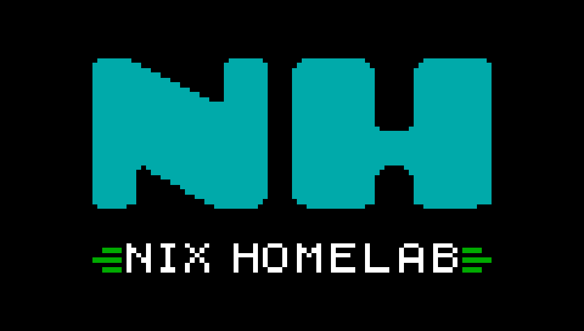
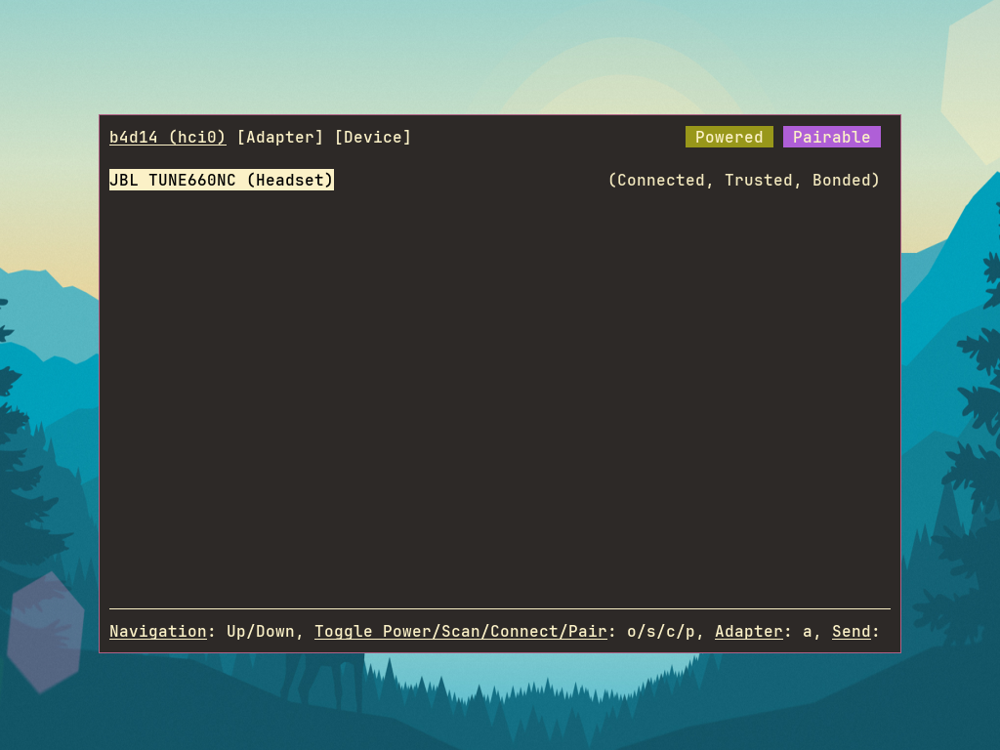
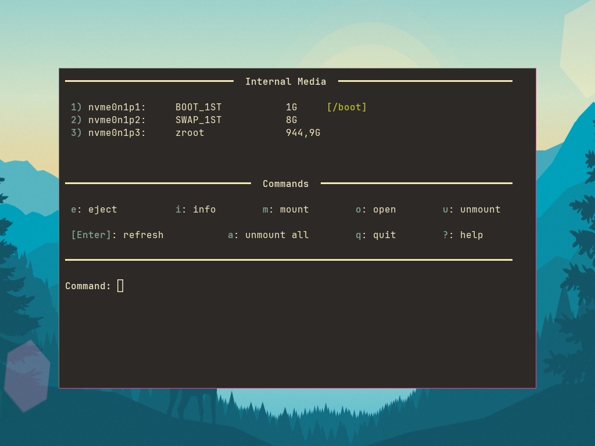
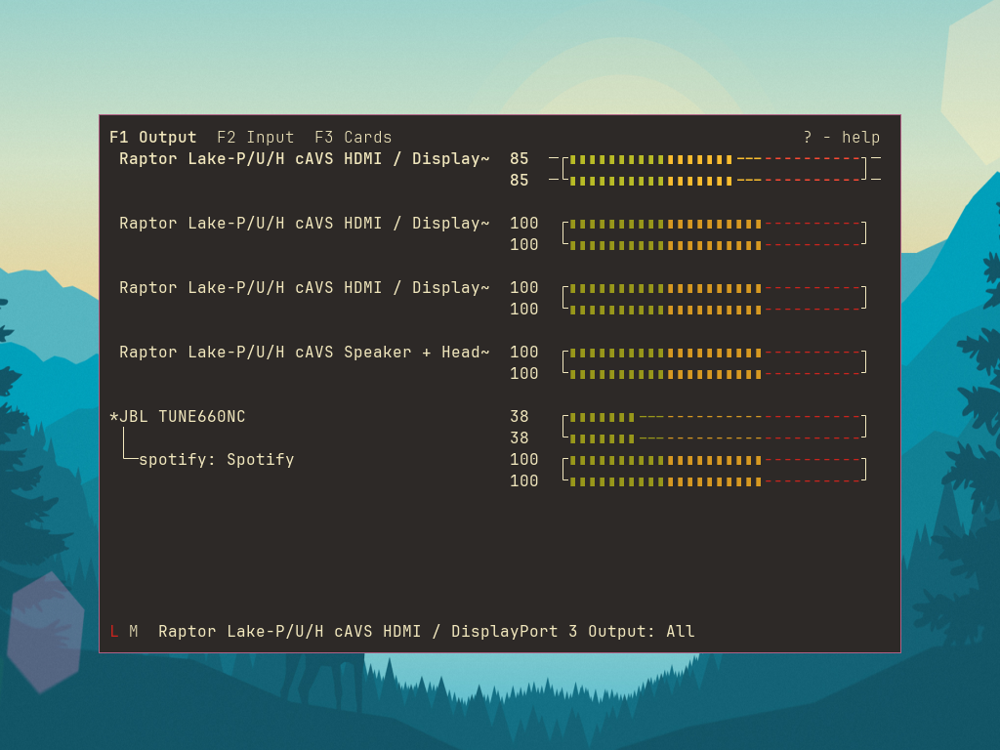
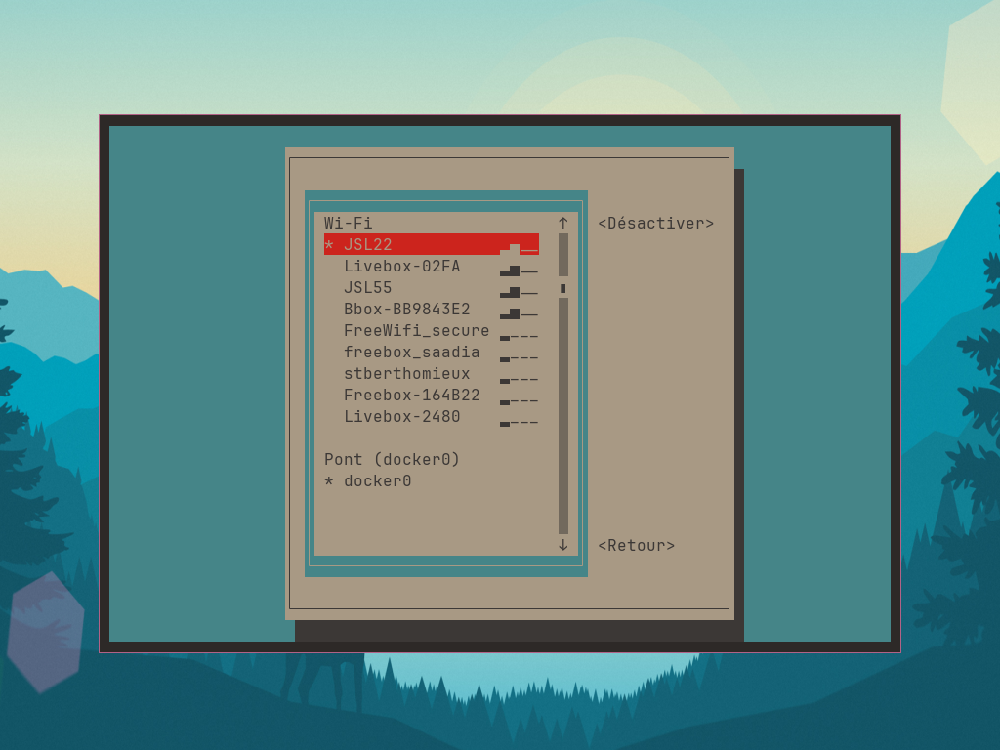
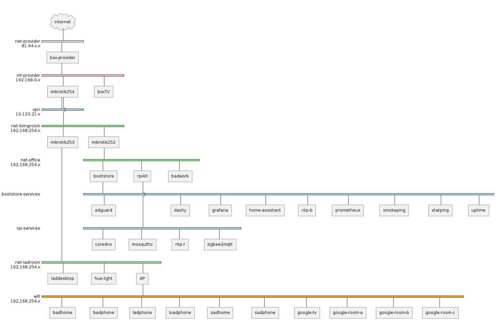
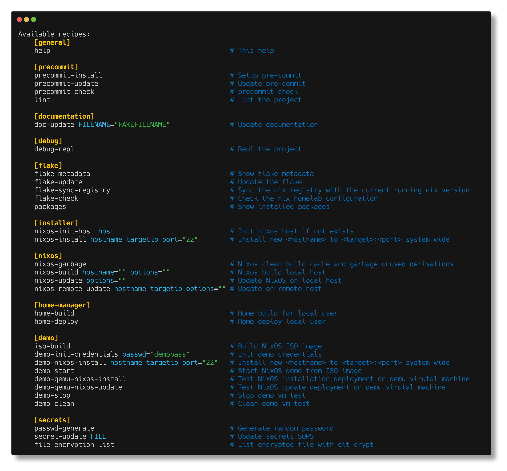

---

<div align="center">
    <h1>
        
    </h1>
    <h3 align="center"><strong>Centralize the configuration of your immutable NixOS machines</strong></h3>
    <p>
        My personal homelab infrastructure, fully managed with
        <a href="https://nixos.org">NixOS</a> and <a href="./docs/clan.md"/>Clan</a>. This repository contains
        all configurations for my servers, desktops, and network devices.
    </p>
    <p align="center">
        <a target="_blank" href="https://github.com/badele/nix-homelab">Home</a> | <a target="_blank" href="https://labrique.ma-cabane.eu/">Public Server</a> | <a target="_blank" href="https://lampiotes.ma-cabane.eu/d/2cd7b23e-e05f-4c13-99aa-bbc1e323337c/attack?var-interval=1h&orgId=1&from=now-24h&to=now&timezone=browser&refresh=1m">Grafana Dashboard</a> | <a target="_blank" href="https://bonnes-adresses.ma-cabane.eu/bookmarks/shared">My bookmarks</a>
    </p>
</div>

### What is this?

This is a complete NixOS homelab setup that manages:

- **Servers**: Public VPS (Hetzner, Infomaniak), physical servers, Raspberry Pi
- **Desktops**: Personal laptops and workstations

Everything is declarative, reproducible, and version-controlled whenever
possible.

### Why Clan?

I'm using [Clan](./docs/clan.md) to simplify infrastructure management:

> Backbone of independent infrastructure

Or as I like to say:

> Kill the cloud, build your darkcloud ☁️

**[→ Learn more about Clan and why I use it](./docs/clan.md)**

#### Key benefits

- **Simple host management**: Easy inventory system
- **Automatic secrets**: Built-in secret generation and management
- **Backup made easy**: Integrated backup solution
- **Declarative**: Everything in code, no manual steps

### 🛠️ Deployment Strategy

I follow a hybrid approach:

- **NixOS services first**: Most applications run as native NixOS services
- **Podman when needed**: Some apps use containers to:
  - Use plugins or features not well-supported in NixOS (e.g., DokuWiki)
  - Avoid service interruptions during system updates
  - Maintain stability during version upgrades

This gives me the best of both worlds: NixOS reproducibility with container
flexibility.

### Project Structure

> [!NOTE]
> 🚧 Work in Progress - The project is being migrated to Clan architecture.
> During this transition, you'll find both old and new directory structures
> coexisting.

The homelab uses a modular flake-parts architecture with Clan: **Key
directories:**

##### 🚧 New structure (managed with clan command)

- `machines/`: Per-host configurations `clan machines update "machine-name"`
- `modules/`: Shared modules and legacy configurations
- `vars/`: Secrets `clan vars list "machine-name"` and on nix expression
  `clan.core.vars.generators."secret-bucket-name"`

##### 💥 Legacy structure

- `nix/nixos/roles/`: Service roles
- `nix/home-manager/`: User environment configs
- `sops/`: SOPS secrets

### 📦 Services & Applications

All Available homelab features :

<!-- BEGIN SECTION services_icon file=./.templates/generate_all_available_icons_features_table.html -->

<table align="center">
  <tr>
    <td align="center" width="16%">
      <a href="/docs/all-features.md#core-services" title="Let's Encrypt client and ACME library written in Go">
        
        <br/>ACME
      </a>
    </td>
    <td align="center" width="16%">
      <a href="/docs/all-features.md#core-services" title="The authentication glue you need. ">
        
        <br/>authentik
      </a>
    </td>
    <td align="center" width="16%">
      <a href="/docs/all-features.md#core-services" title="Fast and lightweight DNS proxy as ad-blocker for local network with many features">
        
        <br/>Blocky
      </a>
    </td>
    <td align="center" width="16%">
      <a href="/docs/all-features.md#system-health" title="Automated developer-oriented status page">
        
        <br/>Gatus
      </a>
    </td>
    <td align="center" width="16%">
      <a href="/docs/all-features.md#core-services" title="Real-time web log analyzer and interactive viewer that runs in a terminal in *nix systems">
        
        <br/>GoAccess
      </a>
    </td>
    <td align="center" width="16%">
      <a href="/docs/all-features.md#system-health" title="Gorgeous metric viz, dashboards & editors for Graphite, InfluxDB & OpenTSDB">
        
        <br/>Grafana
      </a>
    </td>
  </tr>
  <tr>
    <td align="center" width="16%">
      <a href="/docs/all-features.md#essentials" title="Next generation of spreadsheets">
        
        <br/>grist
      </a>
    </td>
    <td align="center" width="16%">
      <a href="/docs/all-features.md#system-health" title="Highly customisable dashboard with Docker and service API integrations">
        
        <br/>Homepage
      </a>
    </td>
    <td align="center" width="16%">
      <a href="/docs/all-features.md#essentials" title="Collection of handy online tools for developers, with great UX">
        
        <br/>it-tools
      </a>
    </td>
    <td align="center" width="16%">
      <a href="/docs/all-features.md#essentials" title="Bookmark manager designed to be minimal, fast, and easy to set up">
        
        <br/>Linkding
      </a>
    </td>
    <td align="center" width="16%">
      <a href="/docs/all-features.md#core-services" title="Lightweight authentication server that provides an opinionated, simplified LDAP interface for authentication">
        
        <br/>LLDAP
      </a>
    </td>
    <td align="center" width="16%">
      <a href="/docs/all-features.md#essentials" title="Minimalist and opinionated feed reader">
        
        <br/>Miniflux
      </a>
    </td>
  </tr>
  <tr>
    <td align="center" width="16%">
      <a href="/docs/all-features.md#core-services" title="Generate a static HTML summary of your Nix homelab instance">
        
        <br/>Nix homelab summary
      </a>
    </td>
    <td align="center" width="16%">
      <a href="/docs/all-features.md#essentials" title="The Ultimate HTML5 Internet Radio Player">
        
        <br/>Pawtunes
      </a>
    </td>
    <td align="center" width="16%">
      <a href="/docs/all-features.md#essentials" title="Internet Radio">
        
        <br/>Radio
      </a>
    </td>
    <td align="center" width="16%">
      <a href="/docs/all-features.md#essentials" title="Sample podman application with hardening options.">
        
        <br/>Sample Podman application
      </a>
    </td>
    <td align="center" width="16%">
      <a href="/docs/all-features.md#essentials" title="Personal, minimalist, super-fast, database free, bookmarking service - community repo">
        
        <br/>Shaarli
      </a>
    </td>
    <td align="center" width="16%">
      <a href="/docs/all-features.md#core-services" title="Private certificate authority (X.509 & SSH) & ACME server for secure automated certificate management, so you can use TLS everywhere & SSO for SSH">
        
        <br/>Step CA
      </a>
    </td>
  </tr>
  <tr>
    <td align="center" width="16%">
      <a href="/docs/all-features.md#system-health" title="Fast, cost-effective and scalable time series database, long-term remote storage for Prometheus">
        
        <br/>Victoriametrics
      </a>
    </td>
    <td align="center" width="16%">
      <a href="/docs/all-features.md#essentials" title="Pastebin service">
        
        <br/>Wastebin
      </a>
    </td>
    <td width="16%"></td>
    <td width="16%"></td>
    <td width="16%"></td>
    <td width="16%"></td>
  </tr>
</table>

<!-- END SECTION services_icon -->

### 💻 Desktop Environment

My workstations run a customized NixOS setup with i3 window manager and various
productivity tools.

#### Desktop Applications

| Logo                                                                                                                                                          | Application | Description                                                                 |
| ------------------------------------------------------------------------------------------------------------------------------------------------------------- | ----------- | --------------------------------------------------------------------------- |
| [](./docs/borgbackup/README.md)                                                                  | borgbackup  | [Deduplication backup tool](./docs/borgbackup/README.md)                    |
|                    | Firefox     | Web browser                                                                 |
|                  | Gimp        | Raster graphics editor                                                      |
|                | i3          | [Tiling window manager](./nix/home-manager/features/desktop/xorg/wm/i3.nix) |
|                                  | Inkscape    | Vector graphics editor                                                      |
|    | LibreOffice | Office suite                                                                |
|                                         | Meld        | Visual diff tool                                                            |
| [](./nix/home-manager/features/term/base.nix)                  | Navi        | [Interactive cheatsheet tool](https://github.com/badele/vide)               |
| [](https://github.com/badele/vide) | Neovim      | [**VIDE** - My customized Neovim config](https://github.com/badele/vide)    |

#### Floating TUI Panels

Quick access to system controls via i3 floating terminals:

| Bluetooth Manager                                     | Disk Manager                                     |
| ----------------------------------------------------- | ------------------------------------------------ |
|  |  |
| `bluetuith`                                           | `bashmount`                                      |

| Audio Mixer                                       | Network Manager                                     |
| ------------------------------------------------- | --------------------------------------------------- |
|  |  |
| `pulsemixer`                                      | `nmtui`                                             |

### 🌐 Infrastructure

#### 🚀 [Houston Server](./machines/houston/README.md)

My main public VPS running on [Hetzner Cloud](https://www.hetzner.com/cloud/)
(CX32: 4 vCPU, 8GB RAM, 80GB SSD).

**What it does:**

- **🔐 Authentication Hub**: Authelia + LLDAP for SSO across all services
- **📊 Full Observability Stack**: Grafana, VictoriaMetrics, Telegraf, Vector
- **📱 Self-Hosted Apps**: DokuWiki, Linkding, Miniflux, Shaarli, and more

**[→ See complete service list and details](./machines/houston/README.md)**

#### 💻 [Gagarin Workstation](./machines/gagarin/README.md)

My main desktop workstation for daily development and productivity.

**Setup:**

- **🪟 i3 Tiling WM**: Efficient workspace management with custom keybindings
- **🛠️ Full Dev Environment**: VIDE (Neovim), VS Code, Git, Docker, and more
- **🎨 Creative Tools**: GIMP, Inkscape, LibreOffice
- **⚙️ System Management**: TUI panels for quick access to system controls

**[→ See complete configuration and tools](./machines/gagarin/README.md)**

#### All Hosts

Complete list of hosts in the homelab (auto-generated with `just doc-update`):

[comment]: (>>HOSTS)

<table>
    <tr>
        <th>Logo</th>
        <th>Name</th>
        <th>OS</th>
        <th>Description</th>
    </tr><tr>
            <td><a href="./docs/hosts/box.md"></a></td>
            <td><a href="./docs/hosts/box.md">box</a>&nbsp;(192.168.0.1)</td>
            <td>Sagem</td>
            <td>SFR internet box</td>
        </tr><tr>
            <td><a href="./docs/hosts/router-living.md"></a></td>
            <td><a href="./docs/hosts/router-living.md">router-living</a>&nbsp;(192.168.254.254)</td>
            <td>MikroTik</td>
            <td>Livingroom mikrotik router</td>
        </tr><tr>
            <td><a href="./docs/hosts/router-ladbedroom.md"></a></td>
            <td><a href="./docs/hosts/router-ladbedroom.md">router-ladbedroom</a>&nbsp;(192.168.254.253)</td>
            <td>MikroTik</td>
            <td>Bedroom mikrotik router</td>
        </tr><tr>
            <td><a href="./docs/hosts/router-homeoffice.md"></a></td>
            <td><a href="./docs/hosts/router-homeoffice.md">router-homeoffice</a>&nbsp;(192.168.254.252)</td>
            <td>MikroTik</td>
            <td>Office mikrotik router</td>
        </tr><tr>
            <td><a href="./docs/hosts/sadhome.md"></a></td>
            <td><a href="./docs/hosts/sadhome.md">sadhome</a>&nbsp;(192.168.254.200)</td>
            <td>NixOS</td>
            <td>Stephanie's laptop</td>
        </tr><tr>
            <td><a href="./docs/hosts/rpi40.md"></a></td>
            <td><a href="./docs/hosts/rpi40.md">rpi40</a>&nbsp;(192.168.254.101)</td>
            <td>NixOS</td>
            <td>The RPI 4 server</td>
        </tr><tr>
            <td><a href="./docs/hosts/bootstore.md"></a></td>
            <td><a href="./docs/hosts/bootstore.md">bootstore</a>&nbsp;(192.168.254.100)</td>
            <td>NixOS</td>
            <td>HP Microserver N40L server</td>
        </tr><tr>
            <td><a href="./docs/hosts/b4d14.md"></a></td>
            <td><a href="./docs/hosts/b4d14.md">b4d14</a>&nbsp;(192.168.254.124)</td>
            <td>NixOS</td>
            <td>Dell XPS 9560 Latop</td>
        </tr><tr>
            <td><a href="./docs/hosts/badxps.md"></a></td>
            <td><a href="./docs/hosts/badxps.md">badxps</a>&nbsp;(192.168.254.114)</td>
            <td>NixOS</td>
            <td>Dell XPS 9570 Latop</td>
        </tr><tr>
            <td></td>
            <td>vm-test&nbsp;(127.0.0.1)</td>
            <td>NixOS</td>
            <td>qemu VM (SSH on port 2222)</td>
        </tr><tr>
            <td></td>
            <td>cab1e&nbsp;(84.234.31.97)</td>
            <td>NixOS</td>
            <td>Wireguard VPN anonymizer server</td>
        </tr>
        <tr>
            <td><a href="./machines/houston/README.md"></a></td>
            <td><a href="./machines/houston/README.md">houston</a>&nbsp;(91.99.130.127)</td>
            <td>NixOS</td>
            <td>Main public server</td>
        </tr>
        <tr>
            <td><a href="./machines/gagarin//README.md"></a></td>
            <td><a href="./machines/gagarin/README.md">gagarin</a>&nbsp;(192.168.254.147)</td>
            <td>NixOS</td>
            <td>My main desktop workstation</td>
        </tr>
</table>

[comment]: (<<HOSTS)

#### Network Topology



#### Common Commands



### ❤️ Thanks

A big thank to the contributors of OpenSource projects in particular :

- [clan project](https://clan.lol/) Simplest way to re-enter independent
  computing with our framework
- [doctor-cluster-config](https://github.com/TUM-DSE/doctor-cluster-config) from
  German TUM School of Computation
- [Mic92](https://github.com/Mic92/dotfiles) and for his some nix contributions
- [Misterio77](https://github.com/Misterio77/nix-config) and for his some nix
  contributions
- [longerHV](https://github.com/LongerHV/nixos-configuration) nix configuration
  file
- [wikipedia](https://www.wikipedia.org) for logos inventories

```
```
