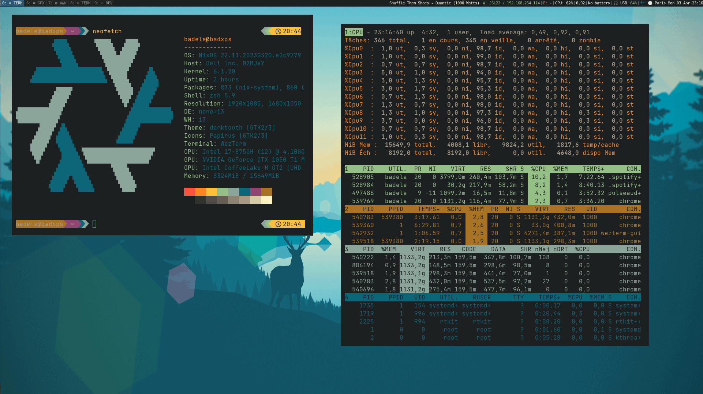

# nix-homelab

This homelab entirelly managed by [NixOS](https://nixos.org/) 

All the configuration is stored on `homelab.json` file, you can do:
- Define network CIDR
- Define hosts
- Define the roles installed for selected hosts
- Define services descriptions
- etc ...

This documentation is generated from `homelab.json` file content 



## Roles

The main roles used in this home lab

This list generated with `inv docs.all-pages` command

[comment]: (>>ROLES)

<table>
    <tr>
        <th>Logo</th>
        <th>Module</th>
        <th>Hosts</th>
        <th>Description</th>
    </tr><tr>
            <td><a href="./docs/wireguard.md"></a></td>
            <td><a href="./docs/wireguard.md">wireguard</a></td>
            <td>router-living, badphone</td>
        <td>An VPN client/server alternative to IPSec and OpenVPN</td>
        <tr>
            <td><a href="./docs/acme.md"></a></td>
            <td><a href="./docs/acme.md">acme</a></td>
            <td>rpi40, bootstore</td>
        <td>Let's Encrypt Automatic Certificate Management Environment</td>
        <tr>
            <td></td>
            <td>coredns</td>
            <td>rpi40</td>
        <td>A Go DNS server, it used for serving local hosts and alias</td>
        <tr>
            <td></td>
            <td>ntp</td>
            <td>rpi40, bootstore</td>
        <td>Network Time Protocol</td>
        <tr>
            <td></td>
            <td>mosquitto</td>
            <td>rpi40</td>
        <td>A mqtt broker [service port 1883]</td>
        <tr>
            <td><a href="./docs/zigbee2mqtt.md"></a></td>
            <td><a href="./docs/zigbee2mqtt.md">zigbee2mqtt</a></td>
            <td>rpi40</td>
        <td>A zigbee2mqtt [service port 8080]</td>
        <tr>
            <td></td>
            <td>adguard</td>
            <td>bootstore</td>
        <td>DNS ad blocker [service port 3002]</td>
        <tr>
            <td></td>
            <td>dashy</td>
            <td>bootstore</td>
        <td>The Ultimate Homepage for your Homelab [service port 8081]</td>
        <tr>
            <td></td>
            <td>grafana</td>
            <td>bootstore</td>
        <td>The open and composable observability and data visualization platform [service port 3000]</td>
        <tr>
            <td></td>
            <td>loki</td>
            <td>bootstore</td>
        <td>Scalable log aggregation system [service port 8084,9095]</td>
        <tr>
            <td></td>
            <td>nfs</td>
            <td>bootstore</td>
        <td>A Linux NFS server, it used for backuping a servers and Latops</td>
        <tr>
            <td><a href="./docs/nix-serve.md"></a></td>
            <td><a href="./docs/nix-serve.md">nix-serve</a></td>
            <td>bootstore</td>
        <td>For caching the nix build results</td>
        <tr>
            <td><a href="./docs/prometheus.md"></a></td>
            <td><a href="./docs/prometheus.md">prometheus</a></td>
            <td>bootstore</td>
        <td>Monitoring system and time series database [service port 9090]</td>
        <tr>
            <td></td>
            <td>smokeping</td>
            <td>bootstore</td>
        <td>Latency measurement tool</td>
        <tr>
            <td></td>
            <td>statping</td>
            <td>bootstore</td>
        <td>A Status Page for monitoring your websites and applications with beautiful graphs [service port 8082]</td>
        <tr>
            <td></td>
            <td>uptime</td>
            <td>bootstore</td>
        <td>A Status Page [service port 3001/8083]</td>
        <tr>
            <td><a href="./docs/home-assistant.md"></a></td>
            <td><a href="./docs/home-assistant.md">home-assistant</a></td>
            <td>bootstore</td>
        <td>Open source home automation [service port 8123]</td>
        </table>

[comment]: (<<ROLES)

## Hosts

List of hosts composing the home lab

This list generated with `inv docs.all-pages` command

[comment]: (>>HOSTS)

<table>
    <tr>
        <th>Logo</th>
        <th>Name</th>
        <th>OS</th>
        <th>Description</th>
    </tr><tr>
            <td><a href="./docs/hosts/box.md"></a></td>
            <td><a href="./docs/hosts/box.md">box</a>&nbsp;(192.168.0.1)</td>
            <td>Sagem</td>
            <td>SFR internet box</td>
        </tr><tr>
            <td><a href="./docs/hosts/router-living.md"></a></td>
            <td><a href="./docs/hosts/router-living.md">router-living</a>&nbsp;(192.168.254.254)</td>
            <td>MikroTik</td>
            <td>Livingroom home mikrotik router</td>
        </tr><tr>
            <td><a href="./docs/hosts/router-bedroom.md"></a></td>
            <td><a href="./docs/hosts/router-bedroom.md">router-bedroom</a>&nbsp;(192.168.254.253)</td>
            <td>MikroTik</td>
            <td>Bedroom home mikrotik router</td>
        </tr><tr>
            <td><a href="./docs/hosts/router-homeoffice.md"></a></td>
            <td><a href="./docs/hosts/router-homeoffice.md">router-homeoffice</a>&nbsp;(192.168.254.252)</td>
            <td>MikroTik</td>
            <td>Office home mikrotik router</td>
        </tr><tr>
            <td><a href="./docs/hosts/sam.md"></a></td>
            <td><a href="./docs/hosts/sam.md">sam</a>&nbsp;(192.168.0.18)</td>
            <td>NixOS</td>
            <td>Samsung N110 Latop</td>
        </tr><tr>
            <td><a href="./docs/hosts/latino.md"></a></td>
            <td><a href="./docs/hosts/latino.md">latino</a>&nbsp;(192.168.254.200)</td>
            <td>NixOS</td>
            <td>Dell Latitude E5540 Latop</td>
        </tr><tr>
            <td><a href="./docs/hosts/rpi40.md"></a></td>
            <td><a href="./docs/hosts/rpi40.md">rpi40</a>&nbsp;(192.168.254.101)</td>
            <td>NixOS</td>
            <td>The Raspberry PI 4 storage server</td>
        </tr><tr>
            <td><a href="./docs/hosts/bootstore.md"></a></td>
            <td><a href="./docs/hosts/bootstore.md">bootstore</a>&nbsp;(192.168.254.100)</td>
            <td>NixOS</td>
            <td>HP Proliant Microserver N40L storage server</td>
        </tr><tr>
            <td><a href="./docs/hosts/badwork.md"></a></td>
            <td><a href="./docs/hosts/badwork.md">badwork</a>&nbsp;(192.168.254.189)</td>
            <td>Nix</td>
            <td>A work thinkpad</td>
        </tr><tr>
            <td><a href="./docs/hosts/badwork-eth.md"></a></td>
            <td><a href="./docs/hosts/badwork-eth.md">badwork-eth</a>&nbsp;(192.168.254.102)</td>
            <td>Nix</td>
            <td>A ethernet work thinkpad</td>
        </tr><tr>
            <td><a href="./docs/hosts/badphone.md"></a></td>
            <td><a href="./docs/hosts/badphone.md">badphone</a>&nbsp;(192.168.254.194)</td>
            <td>Android</td>
            <td>Bruno's phone</td>
        </tr><tr>
            <td><a href="./docs/hosts/ladphone.md"></a></td>
            <td><a href="./docs/hosts/ladphone.md">ladphone</a>&nbsp;(192.168.254.184)</td>
            <td>Android</td>
            <td>Lucas's phone</td>
        </tr><tr>
            <td><a href="./docs/hosts/sadphone.md"></a></td>
            <td><a href="./docs/hosts/sadphone.md">sadphone</a>&nbsp;(192.168.254.188)</td>
            <td>Android</td>
            <td>Steph's phone</td>
        </tr><tr>
            <td><a href="./docs/hosts/loadphone.md"></a></td>
            <td><a href="./docs/hosts/loadphone.md">loadphone</a>&nbsp;(192.168.254.199)</td>
            <td>Iphone</td>
            <td>Lou's phone</td>
        </tr><tr>
            <td><a href="./docs/hosts/tv-chromecast.md"></a></td>
            <td><a href="./docs/hosts/tv-chromecast.md">tv-chromecast</a>&nbsp;(192.168.254.105)</td>
            <td>Chromecast</td>
            <td>TV Chromecast</td>
        </tr><tr>
            <td><a href="./docs/hosts/bedroom-googlemini-A.md"></a></td>
            <td><a href="./docs/hosts/bedroom-googlemini-A.md">bedroom-googlemini-A</a>&nbsp;(192.168.254.197)</td>
            <td>GoogleMini</td>
            <td>Google Mini room A</td>
        </tr><tr>
            <td><a href="./docs/hosts/bedroom-googlemini-C.md"></a></td>
            <td><a href="./docs/hosts/bedroom-googlemini-C.md">bedroom-googlemini-C</a>&nbsp;(192.168.254.196)</td>
            <td>GoogleMini</td>
            <td>Google Mini room C</td>
        </tr><tr>
            <td><a href="./docs/hosts/badxps.md"></a></td>
            <td><a href="./docs/hosts/badxps.md">badxps</a>&nbsp;(192.168.254.114)</td>
            <td>NixOS</td>
            <td>Dell XPS 9570 Latop</td>
        </tr><tr>
            <td><a href="./docs/hosts/bridge-hue.md"></a></td>
            <td><a href="./docs/hosts/bridge-hue.md">bridge-hue</a>&nbsp;(192.168.254.191)</td>
            <td>Bridge</td>
            <td>Philips Hue bridge</td>
        </tr><tr>
            <td><a href="./docs/hosts/sadhome.md"></a></td>
            <td><a href="./docs/hosts/sadhome.md">sadhome</a>&nbsp;(192.168.254.185)</td>
            <td>ArchLinux</td>
            <td>Stephanie's laptop</td>
        </tr></table>

[comment]: (<<HOSTS)

## Network

[comment]: (>>NETWORK)

```mermaid
 graph BT
 linkStyle default interpolate basis
 internet((Internet))
 
 box[<center>SFR internet box</br>192.168.0.1</center>]---internet
router-living[<center>Livingroom mikrotik router</br>192.168.254.254</center>]---box
router-ladbedroom[<center>Bedroom mikrotik router</br>192.168.254.253</center>]---router-living
router-homeoffice[<center>Office mikrotik router</br>192.168.254.252</center>]---router-living
latino[<center>Dell E5540 Latop</br>192.168.254.200</center>]---router-ladbedroom
rpi40[<center>The RPI 4 server</br>192.168.254.101</center>]---router-homeoffice
bootstore[<center>HP Microserver N40L server</br>192.168.254.100</center>]---router-homeoffice
badwork[<center>A work thinkpad</br>192.168.254.189</center>]---router-ladbedroom
badwork-eth[<center>A ethernet work thinkpad</br>192.168.254.102</center>]---router-homeoffice
badphone[<center>Bruno's phone</br>192.168.254.194</center>]---router-ladbedroom
ladphone[<center>Lucas's phone</br>192.168.254.184</center>]---router-ladbedroom
sadphone[<center>Steph's phone</br>192.168.254.188</center>]---router-ladbedroom
loadphone[<center>Lou's phone</br>192.168.254.199</center>]---router-ladbedroom
tv-chromecast[<center>TV Chromecast</br>192.168.254.105</center>]---router-ladbedroom
bedroom-googlemini-A[<center>Google Mini room A</br>192.168.254.197</center>]---router-ladbedroom
bedroom-googlemini-C[<center>Google Mini room C</br>192.168.254.196</center>]---router-ladbedroom
badxps[<center>Dell XPS 9570 Latop</br>192.168.254.114</center>]---router-ladbedroom
bridge-hue[<center>Philips Hue bridge</br>192.168.254.191</center>]---router-ladbedroom
sadhome[<center>Stephanie's laptop</br>192.168.254.185</center>]---router-ladbedroom

subgraph livingroom
box
router-living
tv-chromecast
sadhome
end

subgraph ladbedroom
router-ladbedroom
bridge-hue
end

subgraph homeoffice
router-homeoffice
latino
rpi40
bootstore
badwork
badwork-eth
badxps
end

subgraph badbedroom
bedroom-googlemini-A
end

subgraph loadbedroom
bedroom-googlemini-C
end

```



[comment]: (<<NETWORK)

## Structure

- **Configuration**
    - `homelab.json`: main homelab file configuration (roles servers, network, etc)
    - `hosts`: hosts configuration (system, hardware, host secrets)
    - `users`: users configuration (on user environment, user secrets)
- **System**
    - `nix`: all ***.nix** files
      - `home-manager`: All users ***.nix** files (installed on user environment)
      - `modules`: all nix modules
        - `home-manager`: user modules
        - `nixos`: nixos modules (installed on system wide)
      - `nixos`: all ***.nix** files installed on system wide
      - `overlays`: overlays **nix derivations**
      - `pkgs`: custom nix packages

## Homelab initialisation
```
inv init.domain-cert
```

## NixOS installation & update

See [Commons installation](docs//installation.md)


### Update from you local computer/laptop

```
# Local installation
inv nixos.[build|test|deploy]
inv home.[build|test|deploy]

# Remote installation
inv nixos.[build|test|deploy] --hostnames <hostname>,<hostname>,...
inv home.[build|test|deploy] --username <username> --hostnames <hostname>,<hostname>,...
```

## Update roles or multiple hosts

```
# Simulate deployment(build)
inv role.build --role <rolename>
inv nixos.build --hosts <hostname>,<hostname>

# Install
inv role.deploy --role <rolename>
inv nixos.deploy --hosts <hostname>,<hostname>
```


## Commands

Home lab commands list

This list generated with `inv docs.all-pages` command

[comment]: (>>COMMANDS)

```
Available tasks:

  docs.all-pages               generate all homelab documentation
  docs.host-pages              generate all homelab hosts page
  docs.main-page               generate main homelab page
  docs.scan-all-hosts          Retrieve all hosts system infromations
  home.build                   Test to <hostnames> server
  home.deploy                  Deploy to <hostnames> server
  home.test                    Test to <hostnames> server
  init.disk-format             Format disks with zfs
  init.disk-mount              Mount disks from the installer
  init.domain-cert             Init domain certificate
  init.nix-serve               Init nix binary cache server <hostname> nix-
                               serve private & public key
  init.nixos-generate-config   Generate hardware configuration for the host
  init.nixos-install           install nixos
  init.ssh-init-host-key       Init ssh host key from nixos installation
  nixos.build                  Test to <hostnames> server
  nixos.deploy                 Deploy to <hostnames> server
  nixos.test                   Test to <hostnames> server
  role.build                   Build for all hosts contains the role
  role.deploy                  Deploy for all hosts contains the role
  role.test                    Test for all hosts contains the role


```


[comment]: (<<COMMANDS)


# A big thanks ❤️

A big thank to the contributors of OpenSource projects in particular :
- [doctor-cluster-config](https://github.com/TUM-DSE/doctor-cluster-config) from German TUM School of Computation
- [Mic92](https://github.com/Mic92/dotfiles) and for his some nix contributions
- [Misterio77](https://github.com/Misterio77/nix-config) and for his some nix contributions
- [longerHV](https://github.com/LongerHV/nixos-configuration) nix configuration file
