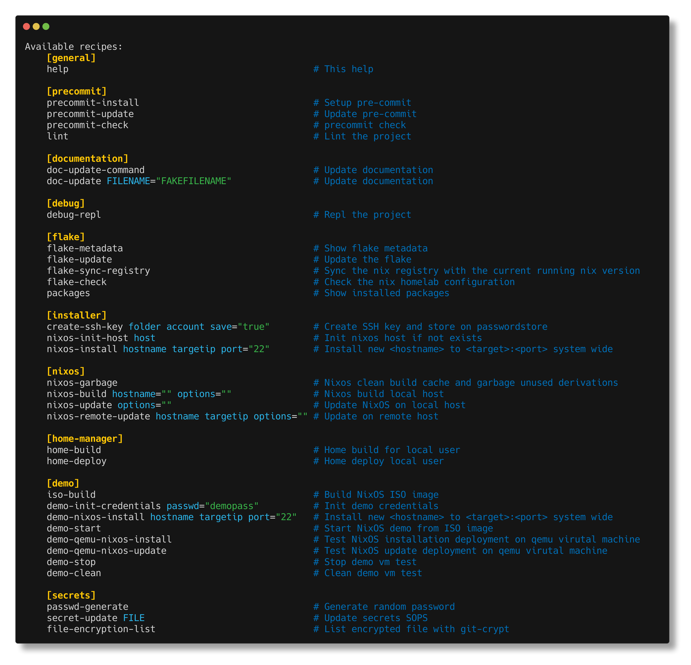

# 🏠 nix-homelab


My personal homelab infrastructure, fully managed with
[NixOS](https://nixos.org/) and [Clan](./docs/clan.md). This repository contains
all configurations for my servers, desktops, and network devices.

## What is this?

This is a complete NixOS homelab setup that manages:

- **Servers**: Public VPS (Hetzner, Infomaniak), physical servers, Raspberry Pi
- **Desktops**: Personal laptops and workstations
- **Network**: Routers, IoT devices, and monitoring

Everything is declarative, reproducible, and version-controlled whenever
possible.

## Why Clan?

I'm using [Clan](./docs/clan.md) to simplify infrastructure management:

> Backbone of independent infrastructure

Or as I like to say:

> Kill the cloud, build your darkcloud ☁️

**[→ Learn more about Clan and why I use it](./docs/clan.md)**

### Key benefits

- **Simple host management**: Easy inventory system
- **Automatic secrets**: Built-in secret generation and management
- **Backup made easy**: Integrated backup solution
- **Declarative**: Everything in code, no manual steps

## 🛠️ Deployment Strategy

I follow a hybrid approach:

- **NixOS services first**: Most applications run as native NixOS services
- **Podman when needed**: Some apps use containers to:
  - Avoid service interruptions during system updates
  - Use plugins or features not well-supported in NixOS (e.g., DokuWiki)
  - Maintain stability during version upgrades

This gives me the best of both worlds: NixOS reproducibility with container
flexibility.

## Project Structure

> [!NOTE]
> 🚧 Work in Progress - The project is being migrated to Clan architecture.
> During this transition, you'll find both old and new directory structures
> coexisting.

The homelab uses a modular flake-parts architecture with Clan: **Key
directories:**

#### 🚧 New structure (managed with clan command)

- `machines/`: Per-host configurations `clan machines update "machine-name"`
- `modules/`: Shared modules and legacy configurations
- `vars/`: Secrets `clan vars list "machine-name"` and on nix expression
  `clan.core.vars.generators."secret-bucket-name"`

#### 💥 Legacy structure

- `nix/nixos/roles/`: Service roles
- `nix/home-manager/`: User environment configs
- `sops/`: SOPS secrets

## 📦 Services & Applications

Here are the main services running in my homelab:

[comment]: (>>ROLES)

<table>
    <tr>
        <th>Logo</th>
        <th>Name</th>
        <th>Type</th>
        <th>Links</th>
        <th>Hosts</th>
        <th>Description</th>
    </tr>
    <tr>
        <td></td>
        <td><a href="https://letsencrypt.org/fr/docs/client-options/">ACME</a></td>
        <td>NixOS</td>
        <td><a href="./docs/acme.md">doc</a></td>
        <td>rpi40, bootstore, houston</td>
        <td>Let's Encrypt Automatic Certificate Management Environment</td>
    </tr>
    <tr>
        <td><a href="./docs/authelia.md"></a></td>
        <td><a href="https://www.authelia.com/">Authelia</a></td>
        <td>NixOS</td>
        <td><a href="./machines/houston/modules/authelia.nix">module</a>, <a href="./docs/authelia.md">doc</a></td>
        <td>houston</td>
        <td>An open-source authentication and single sign-on (SSO)</td>
    </tr>
    <tr>
        <td><a href="./docs/dokuwiki.md"></a></td>
        <td><a href="https://www.dokuwiki.org/">Dokuwiki</a></td>
        <td>Podman</td>
        <td><a href="./machines/houston/modules/dokuwiki.nix">module</a>, <a href="./docs/dokuwiki.md">doc</a></td>
        <td>houston</td>
        <td>Simple to use and highly versatile Open Source wiki software</td>
    </tr>
    <tr>
        <td><a href="https://goaccess.io/"></a></td>
        <td><a href="https://goaccess.io/">GoAccess</a></td>
        <td>NixOS</td>
        <td><a href="./machines/houston/modules/goaccess.nix">module</a></td>
        <td>houston</td>
        <td>Real-time web log analyzer</td>
    </tr>
    <tr>
        <td><a href="./docs/grafana.md"></a></td>
        <td><a href="https://grafana.com/">Grafana</a></td>
        <td>NixOS</td>
        <td><a href="./machines/houston/modules/grafana.nix">module</a>, <a href="./docs/grafana.md">doc</a></td>
        <td>houston</td>
        <td>The open and composable observability and data visualization platform [service port 3000]</td>
    </tr>
    <tr>
        <td><a href="./docs/linkding/README.md"></a></td>
        <td><a href="https://linkding.link/">linkding</a></td>
        <td>Podman</td>
        <td><a href="./machines/houston/modules/linkding.nix">module</a></td>
        <td>houston</td>
        <td>Bookmark manager</td>
    </tr>
    <tr>
        <td><a href="https://goaccess.io/"></a></td>
        <td><a href="https://github.com/lldap/lldap">LLDAP</a></td>
        <td>Podman</td>
        <td><a href="./machines/houston/modules/lldap.nix">module</a>, <a href="./docs/lldap.md">doc</a></td>
        <td>houston</td>
        <td>Lightweight LDAP directory service for authentication</td>
    </tr>
    <tr>
        <td></td>
        <td><a href="https://reaction.ppom.me/">Reaction</a></td>
        <td>NixOS</td>
        <td><a href="./machines/houston/modules/reaction.nix">module</a>, <a href="./docs/reaction.md">doc</a></td>
        <td>houston</td>
        <td>Block some network attacks</td>
    </tr>
    <tr>
        <td></td>
        <td><a href="https://vector.dev/">Vector</a></td>
        <td>NixOS</td>
        <td><a href="./machines/houston/modules/vector/default.nix">module</a>, <a href="./docs/reaction.md">doc</a></td>
        <td>houston</td>
        <td>High-performance observability data pipeline</td>
    </tr>
    <tr>
        <td><a href="./docs/victoriametrics.md"></a></td>
        <td><a href="https://victoriametrics.com/">VictoriaMetrics</a></td>
        <td>NixOS</td>
        <td><a href="./machines/houston/modules/victoriametrics.nix">module</a>, <a href="./docs/victoriametrics.md">doc</a></td>
        <td>houston</td>
        <td>Fast and scalable time series database</td>
    </tr>
    <tr>
        <td></td>
        <td><a href="https://github.com/matze/wastebin">Wastebin</a></td>
        <td>NixOS</td>
        <td><a href="./machines/houston/modules/wastebin.nix">module</a></td>
        <td>houston</td>
        <td>Minimalist pastebin</td>
    </tr>
</table>

[comment]: (<<ROLES)

## 💻 Desktop Environment

My workstations run a customized NixOS setup with i3 window manager and various
productivity tools.

### Desktop Applications

| Logo                                                                                                                                                                                      | Application | Description                                                                 |
| ----------------------------------------------------------------------------------------------------------------------------------------------------------------------------------------- | ----------- | --------------------------------------------------------------------------- |
| [](./docs/borgbackup/README.md)                                                                                              | borgbackup  | [Deduplication backup tool](./docs/borgbackup/README.md)                    |
| [](./users/badele/firefox.nix)                 | Firefox     | [Web browser](./users/badele/firefox.nix)                                   |
| [](./users/badele/commons.nix)               | Gimp        | [Raster graphics editor](./users/badele/commons.nix)                        |
| [](./users/badele/commons.nix)             | i3          | [Tiling window manager](./nix/home-manager/features/desktop/xorg/wm/i3.nix) |
| [](./users/badele/commons.nix)                               | Inkscape    | [Vector graphics editor](./users/badele/commons.nix)                        |
| [](./users/badele/commons.nix) | LibreOffice | [Office suite](./users/badele/commons.nix)                                  |
| [](./users/badele/commons.nix)                                      | Meld        | [Visual diff tool](./users/badele/commons.nix)                              |
| [](./nix/home-manager/features/term/base.nix)                                              | Navi        | [Interactive cheatsheet tool](https://github.com/badele/vide)               |
| [](https://github.com/badele/vide)                             | Neovim      | [**VIDE** - My customized Neovim config](/docs/nvim/README.md)              |

### Floating TUI Panels

Quick access to system controls via i3 floating terminals:

| Bluetooth Manager                                                                      | Disk Manager                                                                 |
| -------------------------------------------------------------------------------------- | ---------------------------------------------------------------------------- |
| [](./docs/floating_bluetooth.gif) | [](./docs/floating_disk.gif) |
| `bluetuith`                                                                            | `bashmount`                                                                  |

| Audio Mixer                                                                    | Network Manager                                                                    |
| ------------------------------------------------------------------------------ | ---------------------------------------------------------------------------------- |
| [](./docs/floating_mixer.gif) | [](./docs/floating_network.gif) |
| `pulsemixer`                                                                   | `nmtui`                                                                            |

## 🌐 Infrastructure

### 🚀 [Houston Server](./machines/houston/README.md)

My main public VPS running on [Hetzner Cloud](https://www.hetzner.com/cloud/)
(CX32: 4 vCPU, 8GB RAM, 80GB SSD).

**What it does:**

- **🔐 Authentication Hub**: Authelia + LLDAP for SSO across all services
- **📊 Full Observability Stack**: Grafana, VictoriaMetrics, InfluxDB, Telegraf,
  Vector
- **📱 Self-Hosted Apps**: DokuWiki, Linkding, Miniflux, Shaarli, and more

**[→ See complete service list and details](./machines/houston/README.md)**

### 💻 [Gagarin Workstation](./machines/gagarin/README.md)

My main desktop workstation for daily development and productivity.

**Setup:**

- **🪟 i3 Tiling WM**: Efficient workspace management with custom keybindings
- **🛠️ Full Dev Environment**: VIDE (Neovim), VS Code, Git, Docker, and more
- **🎨 Creative Tools**: GIMP, Inkscape, LibreOffice
- **⚙️ System Management**: TUI panels for quick access to system controls

**[→ See complete configuration and tools](./machines/gagarin/README.md)**

### All Hosts

Complete list of hosts in the homelab (auto-generated with `just doc-update`):

[comment]: (>>HOSTS)

<table>
    <tr>
        <th>Logo</th>
        <th>Name</th>
        <th>OS</th>
        <th>Description</th>
    </tr><tr>
            <td><a href="./docs/hosts/box.md"></a></td>
            <td><a href="./docs/hosts/box.md">box</a>&nbsp;(192.168.0.1)</td>
            <td>Sagem</td>
            <td>SFR internet box</td>
        </tr><tr>
            <td><a href="./docs/hosts/router-living.md"></a></td>
            <td><a href="./docs/hosts/router-living.md">router-living</a>&nbsp;(192.168.254.254)</td>
            <td>MikroTik</td>
            <td>Livingroom mikrotik router</td>
        </tr><tr>
            <td><a href="./docs/hosts/router-ladbedroom.md"></a></td>
            <td><a href="./docs/hosts/router-ladbedroom.md">router-ladbedroom</a>&nbsp;(192.168.254.253)</td>
            <td>MikroTik</td>
            <td>Bedroom mikrotik router</td>
        </tr><tr>
            <td><a href="./docs/hosts/router-homeoffice.md"></a></td>
            <td><a href="./docs/hosts/router-homeoffice.md">router-homeoffice</a>&nbsp;(192.168.254.252)</td>
            <td>MikroTik</td>
            <td>Office mikrotik router</td>
        </tr><tr>
            <td><a href="./docs/hosts/sadhome.md"></a></td>
            <td><a href="./docs/hosts/sadhome.md">sadhome</a>&nbsp;(192.168.254.200)</td>
            <td>NixOS</td>
            <td>Stephanie's laptop</td>
        </tr><tr>
            <td><a href="./docs/hosts/rpi40.md"></a></td>
            <td><a href="./docs/hosts/rpi40.md">rpi40</a>&nbsp;(192.168.254.101)</td>
            <td>NixOS</td>
            <td>The RPI 4 server</td>
        </tr><tr>
            <td><a href="./docs/hosts/bootstore.md"></a></td>
            <td><a href="./docs/hosts/bootstore.md">bootstore</a>&nbsp;(192.168.254.100)</td>
            <td>NixOS</td>
            <td>HP Microserver N40L server</td>
        </tr><tr>
            <td><a href="./docs/hosts/b4d14.md"></a></td>
            <td><a href="./docs/hosts/b4d14.md">b4d14</a>&nbsp;(192.168.254.124)</td>
            <td>NixOS</td>
            <td>Dell XPS 9560 Latop</td>
        </tr><tr>
            <td><a href="./docs/hosts/badxps.md"></a></td>
            <td><a href="./docs/hosts/badxps.md">badxps</a>&nbsp;(192.168.254.114)</td>
            <td>NixOS</td>
            <td>Dell XPS 9570 Latop</td>
        </tr><tr>
            <td><a href="./docs/hosts/vm-test.md"></a></td>
            <td><a href="./docs/hosts/vm-test.md">vm-test</a>&nbsp;(127.0.0.1)</td>
            <td>NixOS</td>
            <td>qemu VM (SSH on port 2222)</td>
        </tr><tr>
            <td><a href="./docs/hosts/cab1e.md"></a></td>
            <td><a href="./docs/hosts/cab1e.md">cab1e</a>&nbsp;(84.234.31.97)</td>
            <td>NixOS</td>
            <td>Wireguard VPN anonymizer server</td>
        </tr>
        <tr>
            <td><a href="./machines/houston/README.md"></a></td>
            <td><a href="./machines/houston/README.md">houston</a>&nbsp;(91.99.130.127)</td>
            <td>NixOS</td>
            <td>Main public server</td>
        </tr>
        <tr>
            <td><a href="./machines/gagarin//README.md"></a></td>
            <td><a href="./machines/gagarin/README.md">gagarin</a>&nbsp;(192.168.254.147)</td>
            <td>NixOS</td>
            <td>My main desktop workstation</td>
        </tr>
</table>

[comment]: (<<HOSTS)

### Network Topology


### Common Commands



## ❤️ Thanks

A big thank to the contributors of OpenSource projects in particular :

- [clan project](https://clan.lol/) Simplest way to re-enter independent
  computing with our framework
- [doctor-cluster-config](https://github.com/TUM-DSE/doctor-cluster-config) from
  German TUM School of Computation
- [Mic92](https://github.com/Mic92/dotfiles) and for his some nix contributions
- [Misterio77](https://github.com/Misterio77/nix-config) and for his some nix
  contributions
- [longerHV](https://github.com/LongerHV/nixos-configuration) nix configuration
  file
- [wikipedia](https://www.wikipedia.org) for logos inventories

```
```
