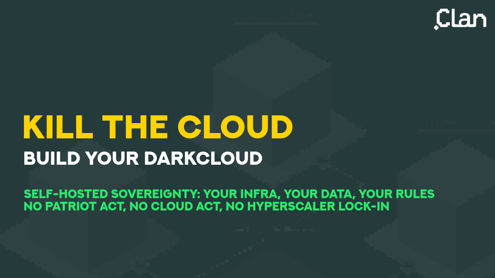

# Clan - Infrastructure Management Framework

<p align="center">
  
</p>

## What is Clan?

[Clan](https://clan.lol/) is a framework that simplifies infrastructure
management for NixOS-based homelabs and clusters. It provides a higher-level
abstraction on top of NixOS flakes, making it easier to manage multiple
machines, secrets, and services.

## Why Use Clan?

> Backbone of independent infrastructure

Clan is designed to help you build and maintain your own independent
infrastructure, reducing reliance on cloud providers. As the motto goes:

> Kill the cloud, build your darkcloud 

## Key Features

### 1. Simple Host Management

Clan provides an easy-to-use inventory system for managing multiple hosts:

```bash
# List all machines
clan machines list

# Update a specific machine
clan machines update "machine-name"

# Add a new machine
clan machines create "new-machine"
```

### 2. Automatic Secret Management

Built-in secret generation and management system:

```bash
# List secrets for a machine
clan vars list "machine-name"

# Generate secrets automatically
clan vars generate "machine-name"
```

Secrets are managed through the `clan.core.vars.generators` system in Nix
expressions:

```nix
clan.core.vars.generators."secret-bucket-name" = {
  # Secret configuration
};
```

### 3. Integrated Backup Solution

Clan makes backup configuration straightforward with built-in support for
various backup strategies.

### 4. Declarative Configuration

Everything is defined in code with no manual steps required. Clan extends
NixOS's declarative approach to the entire infrastructure level.

## How Clan Works

Clan uses a **flake-parts** architecture to organize your infrastructure:

- **machines/**: Per-host configurations managed with `clan machines` commands
- **vars/**: Secrets and variables managed with `clan vars` commands
- **modules/**: Shared modules and configurations

## Getting Started with Clan

### Basic Commands

```bash
# Initialize a new machine
clan machines create hostname

# Deploy to a machine
clan machines update hostname

# Manage secrets
clan vars list hostname
clan vars generate hostname

# Backup operations
clan backups list hostname
clan backups create hostname
```

## Clan vs Plain NixOS

| Feature        | Plain NixOS                | With Clan                 |
| -------------- | -------------------------- | ------------------------- |
| Multiple hosts | Manual flake configuration | Built-in inventory system |
| Secrets        | SOPS/agenix manual setup   | Automatic generation      |
| Backups        | Manual configuration       | Integrated solution       |
| Deployment     | Custom scripts             | `clan machines update`    |

## Learn More

- [Official Documentation](https://docs.clan.lol/)
- [GitHub Repository](https://git.clan.lol/)
