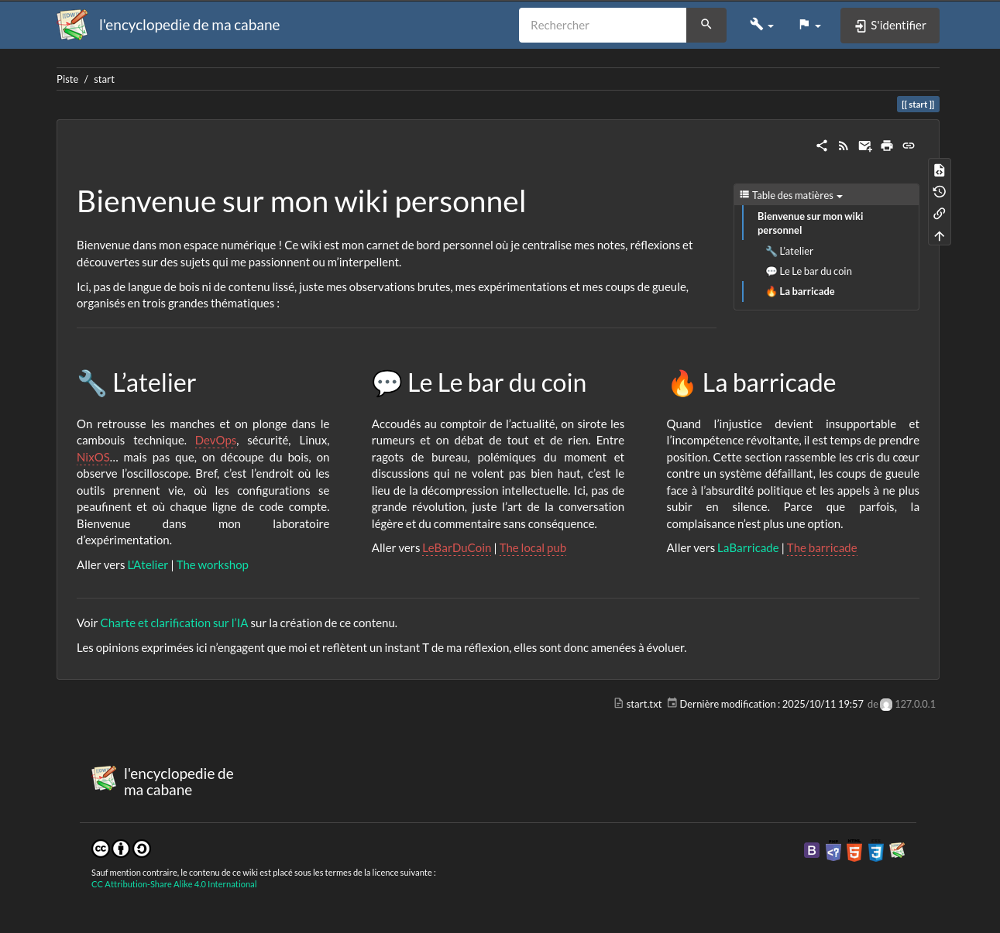

# DokuWiki - Simple & Versatile Wiki Platform

<p align="center">
  
</p>

## What is DokuWiki?

[DokuWiki](https://www.dokuwiki.org/) is a simple to use and highly versatile
open-source wiki software that doesn't require a database. It stores all content
in plain text files, making it extremely lightweight, portable, and easy to
backup.

DokuWiki is perfect for documentation, knowledge bases, intranets, and project
collaboration, especially when you want something simple without the overhead of
a database.

## Why Use DokuWiki?

> Simple, powerful wiki without database complexity

**Key benefits:**

- **No Database Required**: All content stored in flat files, simplifying
  backups and maintenance
- **Clean Syntax**: Easy-to-learn wiki markup that's both readable and powerful
- **Extensive Plugin Ecosystem**: Thousands of plugins to extend functionality
- **Version Control**: Built-in revision history for all pages
- **Access Control**: Granular permissions per page, namespace, or user group
- **Low Resource Usage**: Runs efficiently with minimal server resources
- **Easy Integration**: Works seamlessly with Authelia for SSO authentication

## Service Information

|                key | value                                  |
| -----------------: | -------------------------------------- |
|  installation type | **podman**                             |
| service management | `systemctl <COMMAND> podman-dokuwiki`  |
|           web port | 443 (HTTPS)                            |
|               fqdn | `encyclopedie.ma-cabane.eu`            |
| application folder | `/data/podman/dokuwiki`                |
|      backup folder | `/var/backup/dokuwiki`                 |
|             backup | see [borgbackup](./borgbackup.md)      |
|              emoji | [emoji](https://emojikeyboard.top/fr/) |

### Configuration

The DokuWiki instance is configured in
[machines/houston/modules/dokuwiki.nix](../machines/houston/modules/dokuwiki.nix).

Key configuration parameters:

- **OAuth2 Integration**: Authelia for SSO
- **Storage**: Flat-file based (no database)
- **Main config**: `/data/podman/dokuwiki/config/dokuwiki/conf/local.php`
  (configured with admin interface web UI)

## Initial Setup

After deploying DokuWiki with Clan, perform the initial setup:

1. Access the installation page: `https://encyclopedie.ma-cabane.eu/install.php`

2. Follow the installation wizard:
   - Set wiki name
   - Configure admin account (will be replaced by Authelia later)
   - Set initial ACL policy
   - Complete installation

3. After installation, the `install.php` file will be automatically removed

## Authelia Integration

DokuWiki integrates with [Authelia](./authelia.md) for Single Sign-On (SSO)
authentication using OpenID Connect.

Official documentation:
https://www.authelia.com/integration/openid-connect/clients/dokuwiki/

### Prerequisites

- Authelia
- OAuth2 client secrets must be generated (done automatically by Clan)

### Plugin Installation

Install the following plugins from the DokuWiki admin interface:

1. Go to `Admin` → `Extension Manager`
2. Search and install:
   - **oauth** - OAuth authentication plugin
   - **oauthgeneric** - Generic OAuth provider support

### Plugin Configuration

Configure the OAuth plugins in DokuWiki admin panel:

#### plugin:oauth settings

- **register-on-auth**: `Enabled`
  - Automatically register users on first login

#### plugin:oauthgeneric settings

Navigate to `Admin` → `Configuration Manager` → `oauthgeneric`:

```
plugin»oauthgeneric»key: dokuwiki
plugin»oauthgeneric»secret: <OAUTH2_SECRET>
plugin»oauthgeneric»authurl: https://auth.ma-cabane.eu/api/oidc/authorization
plugin»oauthgeneric»tokenurl: https://auth.ma-cabane.eu/api/oidc/token
plugin»oauthgeneric»userurl: https://auth.ma-cabane.eu/api/oidc/userinfo
plugin»oauthgeneric»authmethod: Bearer Header
plugin»oauthgeneric»scopes: openid,email,profile,groups,offline_access
plugin»oauthgeneric»needs-state: Enabled
plugin»oauthgeneric»json-user: preferred_username
plugin»oauthgeneric»json-name: name
plugin»oauthgeneric»json-mail: email
plugin»oauthgeneric»json-grps: groups
plugin»oauthgeneric»label: Authelia
```

To get the OAuth2 secret:

```bash
clan vars get houston dokuwiki/oauth2-client-secret
```

## User Management

User authentication is handled by [Authelia](./authelia.md), which uses
[LLDAP](./lldap.md) as the user directory.

To manage users:

1. Add users in LLDAP (see [LLDAP documentation](./lldap.md))
2. Users will automatically be created in DokuWiki on first login via Authelia
3. Assign groups in LLDAP to control access permissions in DokuWiki

## Operations

### Access Configuration Files

DokuWiki configuration files are stored in:

```bash
# Main configuration
/data/podman/dokuwiki/config/dokuwiki/conf/local.php

# Plugin configuration
/data/podman/dokuwiki/config/dokuwiki/conf/plugins.local.php
```

### Update OAuth Secrets

If you need to regenerate OAuth2 secrets:

```bash
# On houston server
clan vars generate houston dokuwiki

# Get the new secret
clan vars get houston dokuwiki/oauth2-client-secret

# Update the digest in Authelia configuration
clan vars get houston dokuwiki/digest-client-secret

# Restart both services
systemctl restart podman-dokuwiki
systemctl restart authelia-main
```

### Reset Admin Password

If you need to reset the admin password (before OAuth is set up):

```bash
# On houston server
# Edit the users.auth.php file
sudo -u dokuwiki nano /data/podman/dokuwiki/config/dokuwiki/conf/users.auth.php
```

Or regenerate using DokuWiki's password hash generator at:
`https://encyclopedie.ma-cabane.eu/doku.php?id=wiki:password`

## Learn More

- [Official Documentation](https://www.dokuwiki.org/manual)
- [Plugin Directory](https://www.dokuwiki.org/plugins)
- [Template Directory](https://www.dokuwiki.org/templates)
- [Wiki Syntax Reference](https://www.dokuwiki.org/wiki:syntax)
- [Authelia Integration Guide](https://www.authelia.com/integration/openid-connect/clients/dokuwiki/)
- [NixOS Module](../machines/houston/modules/dokuwiki.nix)
