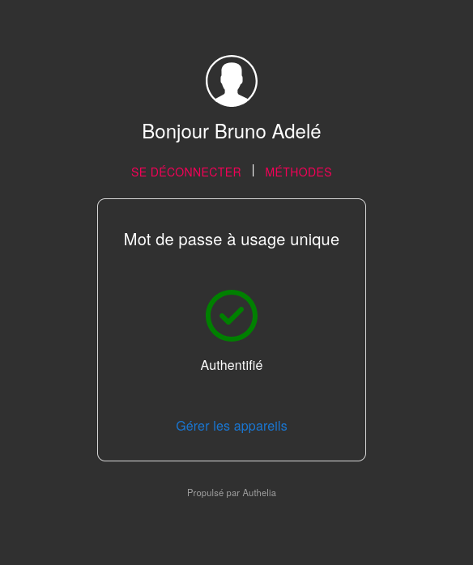

<!-- BEGIN SECTION feature_informations file=./.templates/feature_authelia.html -->

<div class="feature-detail">
  <h1 id="authelia">
    
    Authelia
  </h1>
  <h2>Basic Information</h2>
  <p>Single Sign-On multi-factor portal for web apps</p>
  <table>
    <tbody>
      <tr>
        <th>Category</th>
        <td>
<a href="/docs/all-features.md#core-services">Core Services</a>
        </td>
      </tr>
      <tr>
        <th>Platform</th>
        <td>nixos</td>
      </tr>
      <tr>
        <th>Version</th>
        <td>4.39.12</td>
      </tr>
      <tr>
        <th>Site link</th>
        <td><a href="https://www.authelia.com/">https://www.authelia.com/</a></td>
      </tr>
      <tr>
        <th>Nix Homelab Module</th>
        <td><a href="../../modules/features/authelia">modules/features/authelia</a></td>
      </tr>
    </tbody>
  </table>
  <h2>⚠️ Deprecation Notice</h2>
  <div class="deprecation-notice">
    <p><em>Migrated from Authelia to Authentik. While Authentik requires some manual configuration, it offers more features and better integration capabilities.
// https://github.com/badele/nix-homelab/docs/features/authentik.md
</em></p>
  </div>
</div>

<!-- END SECTION feature_informations -->

## What is Authelia?

[Authelia](https://www.authelia.com/) is an open-source authentication and
authorization server providing 2-factor authentication and single sign-on (SSO)
for applications via a web portal.

It acts as a security gateway between applications and users, providing a
unified authentication layer across all services.



## Why Was Authelia Used?

> Secure access with enterprise-grade authentication and SSO

**Key benefits:**

- **Single Sign-On**: Log in once, access all applications
- **Two-Factor Auth**: TOTP and WebAuthn/U2F security keys
- **LDAP Integration**: Works with LLDAP for centralized user management
- **Granular Access Control**: Per-user, per-group, and resource-specific
  policies
- **Session Management**: Control session lifetime across applications
- **Email Notifications**: Password reset and 2FA codes via SMTP
- **Lightweight**: SQLite storage with minimal resource usage

## Configuration

**LDAP Backend:**

- Base DN: `dc=homelab,dc=lan`
- Integration with [LLDAP](./lldap.md) on port 3890

## Deprecation Status

**Why migrated:**

While Authelia works well for SSO and 2FA, Authentik offers a more modern
interface, better OAuth2/OIDC support, and richer integration capabilities with
third-party applications.

**Recommended alternative:**

Use [Authentik](./authentik.md) instead - a more feature-rich authentication
platform with a modern web UI and better application integration support.

## Learn More

- [Authelia Official Website](https://www.authelia.com/)
- [Authelia GitHub Repository](https://github.com/authelia/authelia)
- [Integration List](https://www.authelia.com/integration/openid-connect/)
- [Alternative: Authentik](./authentik.md)

```
```
