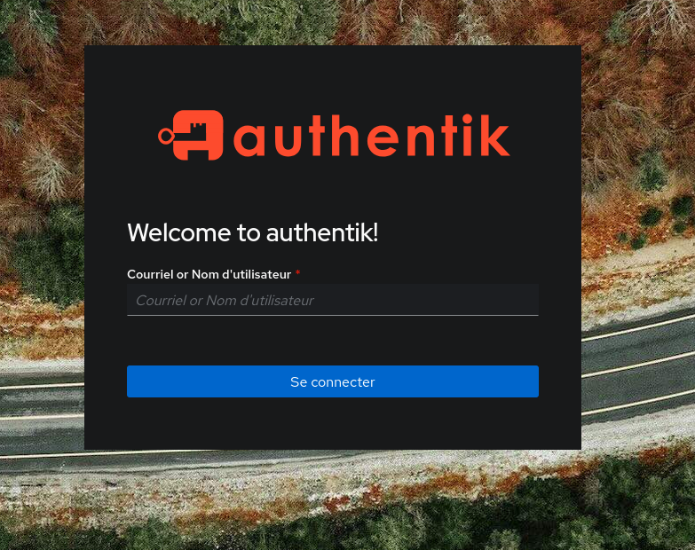

<!-- BEGIN SECTION feature_informations file=./.templates/feature_authentik.html -->

<div class="feature-detail">
  <h1 id="authentik">
    
    authentik
  </h1>
  <h2>Basic Information</h2>
  <p>The authentication glue you need. </p>
  <table>
    <tbody>
      <tr>
        <th>Category</th>
        <td>
<a href="/docs/all-features.md#core-services">Core Services</a>
        </td>
      </tr>
      <tr>
        <th>Platform</th>
        <td>nixos</td>
      </tr>
      <tr>
        <th>Version</th>
        <td>2025.10.12</td>
      </tr>
      <tr>
        <th>Site link</th>
        <td><a href="https://github.com/goauthentik/authentik">https://github.com/goauthentik/authentik</a></td>
      </tr>
      <tr>
        <th>Nix Homelab Module</th>
        <td><a href="../../modules/features/authentik">modules/features/authentik</a></td>
      </tr>
    </tbody>
  </table>
</div>

<!-- END SECTION feature_informations -->

## What is Authentik?

[Authentik](https://goauthentik.io/) is an open-source Identity Provider (IdP)
focused on flexibility and versatility. It provides Single Sign-On (SSO),
OAuth2, SAML, and LDAP authentication for self-hosted applications.

Authentik serves as the central authentication gateway for all homelab services,
enabling unified user management and secure access control.



## Why Use Authentik?

> Unified authentication and identity management for all services

**Key benefits:**

- **Single Sign-On**: One login for all applications
- **Multiple Protocols**: OAuth2/OIDC, SAML, LDAP support
- **Forward Auth**: Protect legacy apps without OIDC support
- **User Management**: Centralized user and group administration, can replace
  LLDAP server.
- **MFA Support**: Multi-factor authentication options
- **Flexible Flows**: Customizable authentication workflows

## Login

Administration account

```
user: akadmin
pass: clan vars get houston authentik/envfile | grep AUTHENTIK_BOOTSTRAP_PASSWORD | cut -d= -f2
```

## Configuration

### Forward Auth for Nginx

To protect services without native OIDC support, use forward authentication:

**Step 1: Create a Proxy Provider**

Navigate to **Applications → Providers → Create**:

- **Type**: `Proxy Provider`
- **Mode**: `Forward auth (single application)`
- **External host**: `https://service-name.ma-cabane.net`
- **Authorization flow**: `default-provider-authorization-implicit-consent`

**Step 2: Create Application**

Navigate to **Applications → Applications → Create**:

- Link to the provider created above
- Configure access permissions

**Step 3: Configure Embedded Outpost**

Navigate to **Applications → Outposts**:

- Edit **"authentik Embedded Outpost"**
- Add your application to **Selected Applications**
- Set **authentik_host**: `https://douane.ma-cabane.net`

**Verification:**

```bash
# Should return 204 No Content
curl -v http://127.0.0.1:9000/outpost.goauthentik.io/ping

# Should return 400 or 401 (NOT 404)
curl -v http://127.0.0.1:9000/outpost.goauthentik.io/auth/nginx
```

### minixflux

**Sample datas :**

- appDomain : `journaliste.ma-cabane.eu`
- appName: `miniflux`

1. Log in to authentik as an administrator and open the authentik Admin
   interface.
1. Navigate to `Applications => Applications (Create with provider)`
   - **Application:** provide a descriptive name
     - name: `${subDomain}`
     - slug `${subDomain}-${appName}`
   - **Choose a Provider type:** Select `OAuth2/OpenID` Provider as the provider
     type.
   - **Configure the Provider:** provide a name (or accept the auto-provided
     name), the authorization flow to use for this provider (`implicit`), and
     the following required configurations.
     - Define `ClientID` to `journaliste-miniflux`
     - Update the `client secret` with
       `clan vars get houston miniflux/oauth2-client-secret`
     - Set a `Strict` redirect URI to
       `https://${appDomain}/oauth2/oidc/callback`
     - Select any available signing key.
   - **Configure Bindings** (optional): you can create a binding (policy, group,
     or user) to manage the listing and access to applications on a user's My
     applications page.
1. Click **Submit** to save the new application and provider.

Source: https://integrations.goauthentik.io/media/miniflux/

### dokuwiki

**Examples :**

- appDomain : `encyclopedie.ma-cabane.eu`
- appName: `dokuwiki`

1. Log in to authentik as an administrator and open the authentik Admin
   interface.
1. Navigate to `Applications => Applications (Create with provider)`
   - **Application:** provide a descriptive name
     - name: `${subDomain}`
     - slug `${subDomain}-${appName}`
     - Optional: Under UI Settings, set the Launch URL to
       `https://${appDomain}/doku.php?id=start&oauthlogin=generic`. This will
       allow you to login directly to DokuWiki from the authentik applications
       dashboard and skip the DokuWiki OAuth Login button.
   - **Choose a Provider type:** Select `OAuth2/OpenID` Provider as the provider
     type.
   - **Configure the Provider:** provide a name (or accept the auto-provided
     name), the authorization flow to use for this provider (`implicit`), and
     the following required configurations.
     - Define `ClientID` to `encyclopedie-dokuwiki`
     - Update the `client secret` with
       `clan vars get houston dokuwiki/oauth2-client-secret`
     - Set a `Strict` redirect URI to `https://${appDomain}/doku.php`
     - Under **Advanced protocol settings**, add the following OAuth mapping
       under **Scopes:** `authentik default OAuth Mapping`:
       `OpenID offline_access`
     - Select any available signing key.
   - **Configure Bindings** (optional): you can create a binding (policy, group,
     or user) to manage the listing and access to applications on a user's My
     applications page.
1. Click **Submit** to save the new application and provider.

Source: https://integrations.goauthentik.io/documentation/dokuwiki/

## Operations

### Password Recovery

Enable password recovery flow:

1. Navigate to **Flows and Stages → Flows**
2. Import
   [Recovery with email verification](https://docs.goauthentik.io/add-secure-apps/flows-stages/flow/examples/flows/#recovery-with-email-verification)
   flow
3. Go to **System → Brands**
4. Enable `recovery` in **Default flow section**

### SMTP Configuration

Monitor email delivery:

Navigate to **Events → Notification transports** to check message status.

## Learn More

- [Authentik Official Documentation](https://goauthentik.io/docs/)
- [Forward Auth with Nginx](https://docs.goauthentik.io/add-secure-apps/providers/proxy/forward_auth)
- [Proxy Provider Setup](https://docs.goauthentik.io/add-secure-apps/providers/proxy/server_nginx)
- [GoAuthentik de A à Y (FR)](https://une-tasse-de.cafe/blog/goauthentik/)
- [Alternative: LLDAP](./lldap.md)
