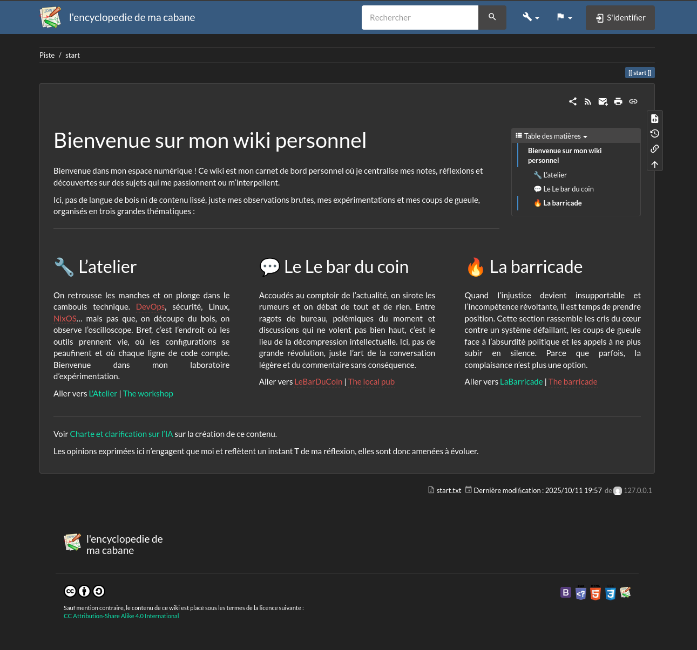

<!-- BEGIN SECTION feature_informations file=./.templates/feature_dokuwiki.html -->

<div class="feature-detail">
  <h1 id="dokuwiki">
    
    DokuWiki
  </h1>
  <h2>Basic Information</h2>
  <p>Simple to use and highly versatile wiki software</p>
  <table>
    <tbody>
      <tr>
        <th>Category</th>
        <td>
<a href="/docs/all-features.md#essentials">Essentials</a>
        </td>
      </tr>
      <tr>
        <th>Platform</th>
        <td>podman</td>
      </tr>
      <tr>
        <th>Version</th>
        <td>version-2025-05-14b</td>
      </tr>
      <tr>
        <th>Site link</th>
        <td><a href="https://www.dokuwiki.org/">https://www.dokuwiki.org/</a></td>
      </tr>
      <tr>
        <th>Nix Homelab Module</th>
        <td><a href="../../modules/features/dokuwiki">modules/features/dokuwiki</a></td>
      </tr>
    </tbody>
  </table>
</div>

<!-- END SECTION feature_informations -->

## What is DokuWiki?

[DokuWiki](https://www.dokuwiki.org/) is a simple to use and highly versatile
open-source wiki software that doesn't require a database. It stores all content
in plain text files, making it extremely lightweight, portable, and easy to
backup.

DokuWiki is perfect for documentation, knowledge bases, intranets, and project
collaboration without the overhead of a database.



## Why Use DokuWiki?

> Simple, powerful wiki without database complexity

**Key benefits:**

- **No Database Required**: All content stored in flat files for easy backups
- **Clean Syntax**: Easy-to-learn wiki markup that's readable and powerful
- **Extensive Plugins**: Thousands of plugins to extend functionality
- **Access Control**: Granular permissions per page, namespace, or user group
- **Low Resource Usage**: Runs efficiently with minimal server resources
- **SSO Integration**: Works with Authentik for OAuth authentication

## Configuration

**Configuration files**

- `/data/podman/dokuwiki/config/dokuwiki/conf/local.php`
- `/data/podman/dokuwiki/config/dokuwiki/conf/plugins.local.php`

** Reset Admin Password**

If you need to reset the admin password (before OAuth is set up):

```bash
sudo -u dokuwiki nano /data/podman/dokuwiki/config/dokuwiki/conf/users.auth.php
```

Or regenerate using DokuWiki's password hash generator at:
`https://encyclopedie.ma-cabane.eu/doku.php?id=wiki:password`

**Plugin Setup:**

After initial installation, install OAuth plugins (`oauth` and `oauthgeneric`)
from the DokuWiki admin interface and configure with Authentik credentials.

### Plugin Installation

Install the following plugins from the DokuWiki admin interface:

1. Go to `Admin` → `Extension Manager`
2. Search and install:
   - **oauth** - OAuth authentication plugin
   - **oauthgeneric** - Generic OAuth provider support

### Plugin Configuration

Configure the OAuth plugins in DokuWiki admin panel:

#### plugin:oauth settings

- **register-on-auth**: `Enabled`
  - Automatically register users on first login

#### plugin:oauthgeneric settings

**OAuth2 Secret:**

```bash
# Get OAuth2 client secret for Authentik configuration
clan vars get houston dokuwiki/oauth2-client-secret
```

Navigate to `Admin` → `Configuration Manager` → `oauthgeneric`:

- Set plugin»oauthgeneric»key to the Client ID from authentik
- Set plugin»oauthgeneric»secret to the Client Secret from authentik
- Set plugin»oauthgeneric»authurl to
  `https://douane.ma-cabane.eu/application/o/authorize/`
- Set plugin»oauthgeneric»tokenurl to
  `https://douane.ma-cabane.eu/application/o/token/`
- Set plugin»oauthgeneric»userurl to
  `https://douane.ma-cabane.eu/application/o/userinfo/`
- Set plugin»oauthgeneric»authmethod to `Bearer Header`
- Set plugin»oauthgeneric»scopes to `email, openid, profile, offline_access`
- Select plugin»oauthgeneric»needs-state
- Set plugin»oauthgeneric»json-user to `preferred_username`
- Set plugin»oauthgeneric»json-name to `name`
- Set plugin»oauthgeneric»json-mail to `email`
- Set plugin»oauthgeneric»json-grps to `groups`

## Learn More

- [DokuWiki Official Website](https://www.dokuwiki.org/)
- [DokuWiki Documentation](https://www.dokuwiki.org/manual)
- [Plugin Directory](https://www.dokuwiki.org/plugins)
- [Wiki Syntax Reference](https://www.dokuwiki.org/wiki:syntax)
