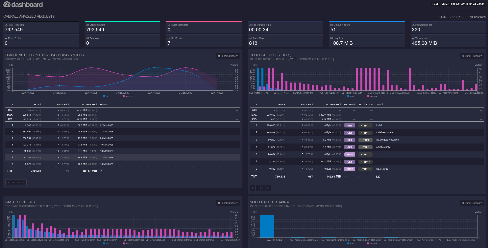

<!-- BEGIN SECTION feature_informations file=./.templates/feature_goaccess.html -->

  <h1 id="goaccess">
    
    GoAccess
  </h1>
  <h2>Basic Information</h2>
  
Real-time web log analyzer and interactive viewer that runs in a terminal in *nix systems

  <table>
    <tbody>
      <tr>
        <th>Category</th>
        <td>
<a href="/docs/all-features.md#core-services">Core Services</a>
        </td>
      </tr>
      <tr>
        <th>Platform</th>
        <td>nixos</td>
      </tr>
      <tr>
        <th>Version</th>
        <td>1.9.4</td>
      </tr>
      <tr>
        <th>Site link</th>
        <td><a href="https://goaccess.io">https://goaccess.io</a></td>
      </tr>
      <tr>
        <th>Nix Homelab Module</th>
        <td><a href="../../modules/features/goaccess">modules/features/goaccess</a></td>
      </tr>
    </tbody>
  </table>

<!-- END SECTION feature_informations -->

## What is GoAccess?

[GoAccess](https://goaccess.io/) is a real-time web log analyzer and interactive
viewer. Written in C, it provides fast analysis of web server logs with terminal
and web-based dashboards showing visitor statistics, traffic patterns, and
performance metrics.

GoAccess parses access logs from Apache, Nginx, Caddy, and other web servers,
displaying detailed insights through an intuitive interface.

## Why Use GoAccess?

> Real-time web log analysis with minimal dependencies

**Key benefits:**

- **Real-Time Updates**: Metrics updated every 200ms in terminal, every second
  in HTML
- **Fast Performance**: Optimized in-memory hash tables for parsing large logs
- **Multiple Outputs**: Terminal, HTML, JSON, and CSV formats
- **Low Dependencies**: Written in C, requires only ncurses
- **Log Format Support**: Apache, Nginx, Caddy, CloudFront, IIS, and custom
  formats
- **Incremental Processing**: On-disk persistence for processing logs over time
- **Rich Metrics**: Visitors, bandwidth, referrers, 404s, slow requests, virtual
  hosts

## Learn More

- [GoAccess Official Website](https://goaccess.io/)
- [GoAccess GitHub Repository](https://github.com/allinurl/goaccess)
- [GoAccess Manual](https://goaccess.io/man)
