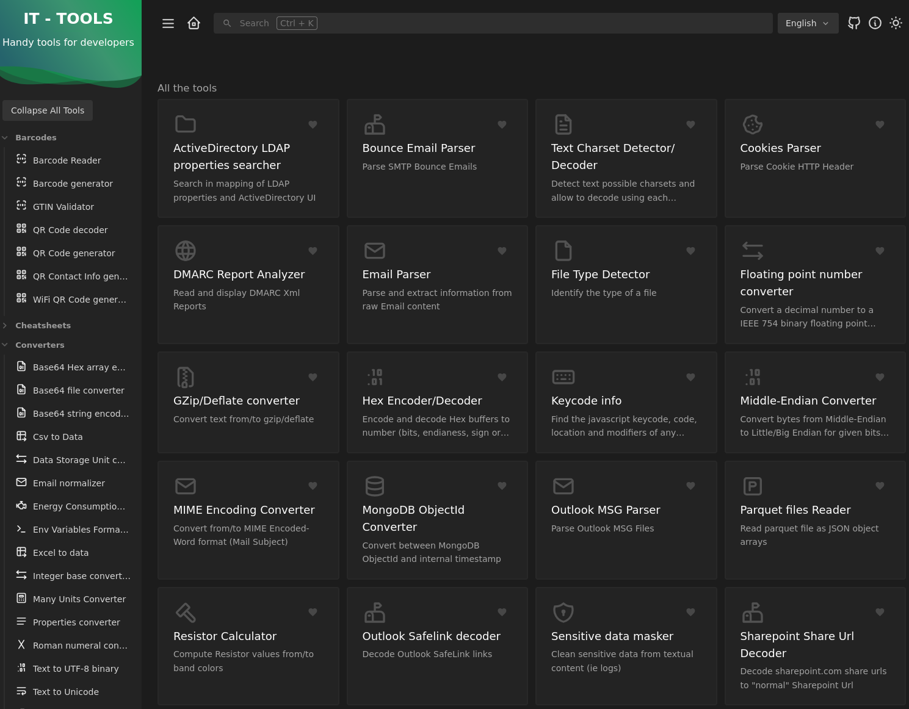

<!-- BEGIN SECTION feature_informations file=./.templates/feature_it-tools.html -->

  <h1 id="it-tools">
    
    it-tools
  </h1>
  <h2>Basic Information</h2>
  
Collection of handy online tools for developers, with great UX

  <table>
    <tbody>
      <tr>
        <th>Category</th>
        <td>
<a href="/docs/all-features.md#essentials">Essentials</a>
        </td>
      </tr>
      <tr>
        <th>Platform</th>
        <td>podman</td>
      </tr>
      <tr>
        <th>Version</th>
        <td>2025.10.12</td>
      </tr>
      <tr>
        <th>Site link</th>
        <td><a href="https://github.com/sharevb/it-tools">https://github.com/sharevb/it-tools</a></td>
      </tr>
      <tr>
        <th>Nix Homelab Module</th>
        <td><a href="../../modules/features/it-tools">modules/features/it-tools</a></td>
      </tr>
    </tbody>
  </table>

<!-- END SECTION feature_informations -->

## What is IT-Tools?

[IT-Tools](https://github.com/CorentinTh/it-tools) is a collection of handy
online tools for developers and IT professionals. Built with Vue 3 as a PWA, it
provides 70+ utilities with a clean, intuitive interface.

IT-Tools offers encoding/decoding tools, generators, converters, formatters, and
more - all in one self-hosted web application.

## Why Use IT-Tools?

> Collection of 70+ developer utilities with great UX

**Key benefits:**

- **70+ Tools**: Token generator, case converter, base64, QR codes, and more
- **Great UX**: Clean interface with intuitive navigation
- **Favorites**: Pin frequently used tools for quick access
- **PWA**: Install as a Progressive Web App for offline use
- **Docker Integration**: Convert Docker run commands to Docker Compose
- **Free & Open Source**: Self-hosted with no tracking or data collection
- **No Installation**: Browser-based tools requiring no setup

## Learn More

- [IT-Tools Official Website](https://it-tools.tech/)
- [IT-Tools GitHub Repository](https://github.com/CorentinTh/it-tools)
- [IT-Tools Fork](https://github.com/sharevb/it-tools)
