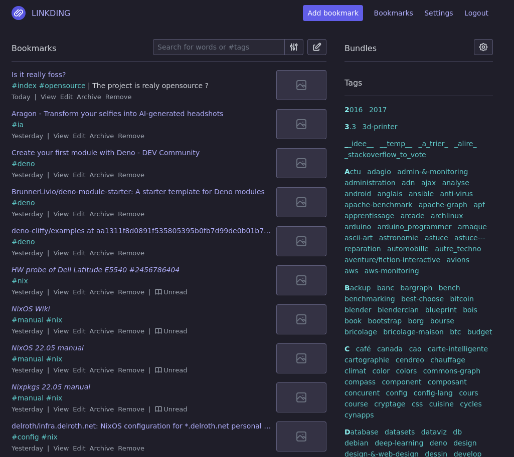

<!-- BEGIN SECTION feature_informations file=./.templates/feature_linkding.html -->

<div class="feature-detail">
  <h1 id="linkding">
    
    Linkding
  </h1>
  <h2>Basic Information</h2>
  <p>Bookmark manager designed to be minimal, fast, and easy to set up</p>
  <table>
    <tbody>
      <tr>
        <th>Category</th>
        <td>
<a href="/docs/all-features.md#essentials">Essentials</a>
        </td>
      </tr>
      <tr>
        <th>Platform</th>
        <td>podman</td>
      </tr>
      <tr>
        <th>Version</th>
        <td>1.41.0-plus</td>
      </tr>
      <tr>
        <th>Site link</th>
        <td><a href="https://github.com/sissbruecker/linkding">https://github.com/sissbruecker/linkding</a></td>
      </tr>
      <tr>
        <th>Nix Homelab Module</th>
        <td><a href="../../modules/features/linkding">modules/features/linkding</a></td>
      </tr>
    </tbody>
  </table>
</div>

<!-- END SECTION feature_informations -->

## What is Linkding?

[Linkding](https://github.com/sissbruecker/linkding) is a self-hosted bookmark
manager designed to be minimal, fast, and easy to set up. Built with Django and
a modern Node.js frontend, it provides a clean interface for managing bookmarks
with powerful organization and search capabilities.

Linkding focuses on simplicity and speed while offering essential features like
tagging, full-text search, archiving, and sharing. It's designed as a
lightweight alternative to more complex bookmark management solutions.



## Why Use Linkding?

> Self-hosted bookmark manager with minimal setup and maximum efficiency

**Key benefits:**

- **Minimalist Design**: Clean, distraction-free interface focused on bookmark
  management
- **Fast Performance**: Quick search and navigation through thousands of
  bookmarks
- **Tag-Based Organization**: Flexible tagging system with nested tag support
- **Full-Text Search**: Search through bookmark titles, descriptions, notes, and
  tags
- **Markdown Support**: Rich notes with Markdown formatting for each bookmark
- **Bulk Operations**: Edit multiple bookmarks at once for efficient management
- **Archive Integration**: Automatic snapshots via Internet Archive Wayback
  Machine
- **Browser Integration**: Official extensions for Chrome, Firefox, and Edge
- **REST API**: Full API access for automation and integrations
- **PWA Support**: Install as a Progressive Web App on mobile devices
- **SSO Ready**: OpenID Connect support for enterprise authentication

### Configuration

## User Management

### Superuser Account

A superuser account is automatically created:

- **Username**: `bookadmin`
- **Password**: Auto-generated (see secrets)

To get the superuser password:

```bash
# On houston server
grep LD_SUPERUSER_PASSWORD /run/secrets/vars/linkding/envfile
```

## Operations

### Import Bookmarks from Browser

To import bookmarks from Firefox or other browsers:

1. **Clean up broken links** (optional but recommended):
   - Install
     [Bookmarks Organizer](https://addons.mozilla.org/firefox/addon/bookmarks-organizer/)
   - Run the cleanup tool

2. **Export bookmarks using buku**:

   ```bash
   # Install buku
   nix shell nixpkgs#buku

   # Auto-import from browser
   buku --ai

   # Export with tags (based on folder names)
   buku -e bookmarks-with-tags.html
   ```

3. **Import to Linkding**:
   - Go to Linkding web interface
   - Navigate to Settings → Import
   - Upload the `bookmarks-with-tags.html` file
   - Tags will be preserved based on folder structure
