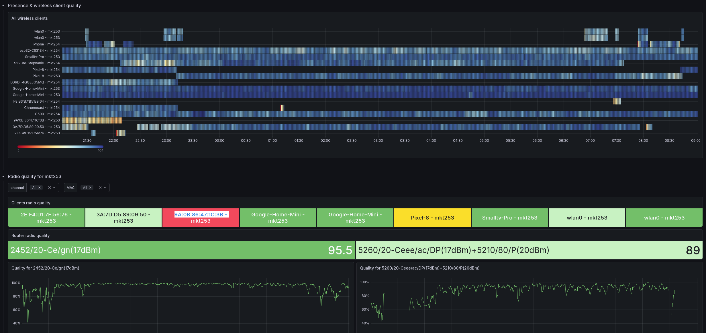

<!-- BEGIN SECTION feature_informations file=./.templates/feature_mikrotik.html -->

<div class="feature-detail">
  <h1 id="mikrotik">
    
    MikroTik
  </h1>
  <h2>Basic Information</h2>
  <p>MikroTik RouterOS management helpers</p>
  <table>
    <tbody>
      <tr>
        <th>Category</th>
        <td>
<a href="/docs/all-features.md#core-services">Core Services</a>
        </td>
      </tr>
      <tr>
        <th>Platform</th>
        <td>nixos</td>
      </tr>
      <tr>
        <th>Version</th>
        <td>1.2.17</td>
      </tr>
      <tr>
        <th>Site link</th>
        <td><a href="https://mikrotik.com/">https://mikrotik.com/</a></td>
      </tr>
      <tr>
        <th>Nix Homelab Module</th>
        <td><a href="../../modules/features/mikrotik">modules/features/mikrotik</a></td>
      </tr>
    </tbody>
  </table>
</div>

<!-- END SECTION feature_informations -->

## What is MikroTik?

[MikroTik](https://mikrotik.com/) provides RouterOS, a network operating system
used on MikroTik routers and switches. In this homelab, the MikroTik feature
adds NixOS-managed helpers for backing up RouterOS configurations.

The backup helper creates both a binary RouterOS backup and a text export, then
encrypts both files locally with age.



## Why Use MikroTik?

> Encrypted RouterOS configuration backups managed from NixOS

**Key benefits:**

- **Dedicated Account**: Uses a local NixOS `mikrotik` user and a RouterOS
  `backup` account
- **Encrypted Backups**: Stores `.backup` and `.rsc` files encrypted with age
- **Per-Router History**: Keeps backups under one directory per router
- **Retention Policy**: Keeps only the configured number of local backup pairs
- **Manual Restore Helpers**: Decrypts and copies restore files without loading
  them automatically on the router

## Configuration

### NixOS Setup

Enable the MikroTik feature on the machine that collects router backups:

```nix
homelab.features.mikrotik = {
  enable = true;
  backup = true;

  prometheus = {
    enable = true;
    openFirewall = true;
    verbose = true;
    remoteDhcpServerVlan = "mgmt";
    serviceDomain = "mikrotik-exporter.infra.${config.homelab.domain}";
    registerScope = [ "private" ];
    listenInterfaces = lib.mkForce [
      "br-infra"
    ];
  };

  routers = [
    {
      name = "mkt254";
      host = "192.168.244.254";
    }
    {
      name = "mkt253";
      host = "192.168.244.253";
    }
    {
      name = "mkt252";
      host = "192.168.244.252";
    }
  ];
};
```

The feature creates a local system user named `mikrotik`, a dedicated SSH key,
and a dedicated age key.

Get the SSH public key that must be installed on each router:

```bash
just clan-vars-get <MACHINE> mikrotik/ssh.id_ed25519.pub
```

Get the RouterOS password used by the Prometheus exporter:

```bash
just clan-vars-get <MACHINE> mikrotik/prometheus_credentials | sed -n 's/^password: //p'
```

### RouterOS User Setup

Create the dedicated RouterOS backup user and group:

```routeros
/user group add name=backup policy=ssh,ftp,read,write,policy,test,password,sensitive,!local,!telnet,!reboot,!winbox,!web,!sniff,!api,!romon,!rest-api
/user add name=backup group=backup comment="nix-homelab backup account"
```

Create the dedicated RouterOS Prometheus user and group:

```routeros
/user group add name=prometheus policy=read,api,!local,!telnet,!ssh,!ftp,!reboot,!write,!policy,!test,!password,!web,!sniff,!sensitive,!romon,!rest-api
/user add name=prometheus group=prometheus password="<mikrotik/prometheus_credentials password>"
```

The Prometheus exporter uses the RouterOS API, not SSH. Enable the plain API
service on each router and restrict it to the NixOS collector address:

```routeros
/ip service set api disabled=no port=8728 address=<collector-ip>/32
```

If the router has an input firewall drop rule, allow the collector before that
drop rule:

```routeros
/ip firewall filter add chain=input action=accept protocol=tcp src-address=<collector-ip> dst-port=8728 comment="ADM IPV4 MKTXP API"
```

Replace `<collector-ip>` with the source address used by the NixOS host to
reach the router. Find it on the collector with:

```bash
ip route get 192.168.244.254
```

### RouterOS Syslog Setup

Send RouterOS logs to the central Vector syslog collector. The collector
normalizes the events and forwards them to VictoriaLogs:

```routeros
/system logging action add name=victorialogs target=remote remote=<collector-ip> remote-port=5514 bsd-syslog=yes syslog-facility=local0
/system logging add topics=info action=victorialogs
/system logging add topics=warning action=victorialogs
/system logging add topics=error action=victorialogs
/system logging add topics=critical action=victorialogs
```

Replace `<collector-ip>` with the `constellation` address reachable from the
router, for example the `br-infra` address.

### SSH Key Registration

From a sysops workstation, fetch the public key for the NixOS host that runs
`mikrotik-backup`, then copy and import it on the router.

```bash
HOSTNAME=constellation
ROUTER=192.168.244.254
KEY_FILE=nixos_${HOSTNAME}_mikrotik.pub

just clan-vars-get "$HOSTNAME" mikrotik/ssh.id_ed25519.pub > "/tmp/$KEY_FILE"
scp "/tmp/$KEY_FILE" "admin@$ROUTER:$KEY_FILE"
ssh -n "admin@$ROUTER" "/user ssh-keys import public-key-file=$KEY_FILE user=backup"
rm -f "/tmp/$KEY_FILE"
```

To test the private key from a sysops workstation:

```bash
HOSTNAME=constellation
ROUTER=192.168.244.254
KEY_FILE=/tmp/nixos_${HOSTNAME}_mikrotik_ed25519

just clan-vars-get "$HOSTNAME" mikrotik/ssh.id_ed25519 > "$KEY_FILE"
chmod 600 "$KEY_FILE"

ssh -i "$KEY_FILE" -o IdentitiesOnly=yes backup@"$ROUTER"

rm -f "$KEY_FILE"
```

### Backup Operations

Backups are stored under:

```text
/data/backup/mikrotik/<router>/
```

Each run creates two encrypted files:

```text
<timestamp>.backup.age
<timestamp>.rsc.age
```

Run a manual backup:

```bash
systemctl start mikrotik-backup
```

Inspect the last execution:

```bash
systemctl status mikrotik-backup
journalctl -u mikrotik-backup
```

The feature also exposes service aliases:

```bash
@service-mikrotik-backup-start
@service-mikrotik-backup-status
@service-mikrotik-backup-journal
```

The timer runs daily at 03:30 by default and keeps the 30 newest encrypted
backup/export files per router.

### Prometheus Operations

When `prometheus.enable = true`, the feature runs
[`mktxp`](https://github.com/akpw/mktxp) as a local systemd service.

`mktxp` connects to each router with the RouterOS API on TCP `8728` by default.
If a router uses a different API port, set `apiPort` on that router:

```nix
routers = [
  {
    name = "mkt254";
    host = "192.168.244.254";
    apiPort = 8728;
  }
];
```

To resolve `dhcp_name` labels from a central DHCP server, set
`prometheus.remoteDhcpServerVlan` to the VLAN used to reach that RouterOS DHCP
server:

```nix
homelab.features.mikrotik.prometheus.remoteDhcpServerVlan = "infra";
```

The DHCP server address comes from
`homelab.vlans.<vlan>.dhcpServerIp`, which defaults to
`192.168.<vlan.id>.254`. MKTXP receives this as a generated
`remote_dhcp_entry`; the selected VLAN chooses the API address, not a DHCP lease
filter.

The exporter always listens on localhost for local scraping:

```text
127.0.0.1:10220
```

When `prometheus.openFirewall = true`, Caddy exposes it over HTTPS on
`prometheus.serviceDomain`, using the IPv4 addresses of
`prometheus.listenInterfaces`. The raw metrics port is not opened directly.

Inspect the exporter:

```bash
systemctl status mikrotik-mktxp
journalctl -u mikrotik-mktxp -f
curl http://127.0.0.1:10220/metrics
curl https://mikrotik-exporter.infra.example.net/metrics
```

If `/metrics` only shows `python_gc_*` metrics, the HTTP exporter is running
but MKTXP did not emit RouterOS metrics. Enable `prometheus.verbose = true` and
check the journal for API connection or authentication errors.

The feature also exposes exporter service aliases:

```bash
@service-mikrotik-exporter-start
@service-mikrotik-exporter-status
@service-mikrotik-exporter-journal
@service-mikrotik-exporter-config-default
@service-mikrotik-exporter-config-routers
```

Check API reachability from the NixOS host:

```bash
nc -vz 192.168.244.254 8728
nc -vz 192.168.244.253 8728
```

VictoriaMetrics scrapes this endpoint automatically when the VictoriaMetrics
feature is enabled.

When Grafana is enabled, the feature provisions the "Mikrotik MKTXP Exporter"
dashboard from Grafana Labs dashboard `13679` revision `28`.

### Restore Operations

Run the restore helpers from the NixOS host that runs `mikrotik-backup`. The
helpers must be run as the local `mikrotik` user. From `root`, open a shell
with:

```bash
su mikrotik -s /run/current-system/sw/bin/bash
```

List encrypted backups for a router:

```bash
@mikrotik-list-backup-for-router mkt254
```

The command prints full paths:

```text
  backup: /data/backup/mikrotik/mkt254/20260801T142235Z.backup.age
  export: /data/backup/mikrotik/mkt254/20260801T142235Z.rsc.age
```

Copy a backup pair to a router. Pass the absolute path of either file from the
encrypted pair:

```bash
@mikrotik-restore-backup-file-for-router \
  /data/backup/mikrotik/mkt254/20260801T142235Z.backup.age \
  192.168.244.254
```

The helper uses:

```text
/run/secrets/vars/mikrotik/age.key
/run/secrets/vars/mikrotik/ssh.id_ed25519
```

It does not run the restore command automatically.

After the files are copied, check them on the router:

```routeros
/file print where name~"restored-nix-homelab-20260801T142235Z"
```

Restore the binary backup:

```routeros
/system backup load name=restored-nix-homelab-20260801T142235Z.backup
```

The binary backup is the complete RouterOS restore path. It replaces the router
configuration and reboots the router.

The text export can be inspected or imported separately:

```routeros
/import file-name=restored-nix-homelab-20260801T142235Z.rsc
```

### Router upgrade

Upgrade one router at a time. Start with the downstream routers, then upgrade
the gateway router last. Keep a local console or another access path available
when possible.

Before upgrading, create a fresh encrypted backup and make sure the restore
path is available. See [Backup Operations](#backup-operations) and
[Restore Operations](#restore-operations).

Check the installed RouterOS packages and whether a new stable release is
available:

```routeros
/system package update set channel=stable
/system package update check-for-updates
```

Example output:

```text
channel: stable
installed-version: 7.14.1
   latest-version: 7.15.2
           status: New version is available
```

Install the RouterOS package update:

```routeros
/system package update install
```

The router downloads the packages, installs them, and reboots.

After RouterOS has rebooted, check the RouterBOARD firmware versions:

```routeros
/system routerboard print
```

Example output:

```text
routerboard: yes
           model: RB4011iGS+5HacQ2HnD
        revision: r2
   firmware-type: al2
factory-firmware: 6.45.9
current-firmware: 6.45.9
upgrade-firmware: 7.16.2
```

If `upgrade-firmware` is newer than `current-firmware`, upgrade the firmware and
reboot again:

```routeros
/system routerboard upgrade
/system reboot
```

After the final reboot, verify the installed versions and check the recent
system logs:

```routeros
/system package update print
/system routerboard print
/log print where topics~"system"
```

## Learn More

- [MikroTik Official Website](https://mikrotik.com/)
- [RouterOS Configuration Management](https://help.mikrotik.com/docs/spaces/ROS/pages/328155/Configuration+Management)
- [Changelog](https://mikrotik.com/download/changelogs?channelFilter=)
