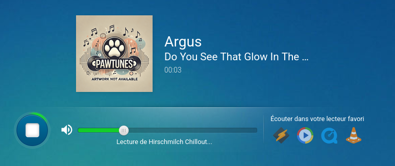

<!-- BEGIN SECTION feature_informations file=./.templates/feature_pawtunes.html -->

  <h1 id="pawtunes">
    
    Pawtunes
  </h1>
  <h2>Basic Information</h2>
  
The Ultimate HTML5 Internet Radio Player

  <table>
    <tbody>
      <tr>
        <th>Category</th>
        <td>
<a href="/docs/all-features.md#essentials">Essentials</a>
        </td>
      </tr>
      <tr>
        <th>Platform</th>
        <td>podman</td>
      </tr>
      <tr>
        <th>Version</th>
        <td>1.0.6</td>
      </tr>
      <tr>
        <th>Site link</th>
        <td><a href="https://github.com/Jackysi/PawTunes">https://github.com/Jackysi/PawTunes</a></td>
      </tr>
      <tr>
        <th>Nix Homelab Module</th>
        <td><a href="../../modules/features/pawtunes">modules/features/pawtunes</a></td>
      </tr>
    </tbody>
  </table>
  <h2>⚠️ Deprecation Notice</h2>
  

    
<em>This feature is deprecated due to Docker image initialization complexity.

Recommended alternative: Use the simpler Radio application which provides
a lightweight internet radio player without the Docker initialization overhead
// https://github.com/badele/nix-homelab/docs/features/radio.md

</em>

  

<!-- END SECTION feature_informations -->

## What is PawTunes?

[PawTunes](https://github.com/Jackysi/PawTunes) is a web-based internet radio
player with automatic track information and artwork fetching. Built with HTML5,
it provides a rich listening experience for Icecast/Shoutcast streams.

## Why Was PawTunes Used?

> Internet radio player with automatic metadata and artwork

**Key features:**

- HTML5 audio player with responsive design
- Automatic track information from multiple sources (Icecast, Shoutcast,
  AzuraCast)
- Artwork fetching from iTunes, Spotify, LastFM, and FanArt TV
- Multi-channel support with multi-bitrate streaming
- WebSocket support for real-time updates
- Bluetooth device integration via MediaInfoAPI

## Deprecation Status

**Why deprecated:**

PawTunes requires a Docker image with complex initialization that adds
unnecessary overhead for a simple radio player use case.

**Recommended alternative:**

Use [Radio](./radio.md) instead - a lightweight Go-based internet radio player
with native NixOS integration and no Docker complexity.

## Learn More

- [PawTunes Official Documentation](https://doc.prahec.com/pawtunes)
- [PawTunes GitHub Repository](https://github.com/Jackysi/PawTunes)
- [Docker Hub Image](https://hub.docker.com/r/jackyprahec/pawtunes)
- [Internet Radio Streaming Overview](https://en.wikipedia.org/wiki/Internet_radio)
- [Alternative: Radio](./radio.md)
