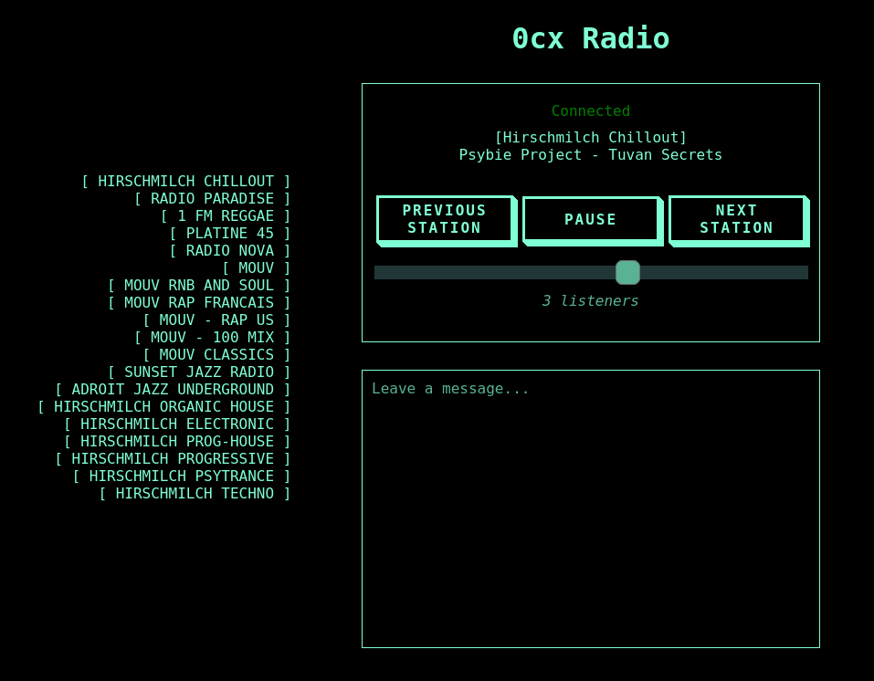

<!-- BEGIN SECTION feature_informations file=./.templates/feature_radio.html -->

  <h1 id="radio">
    
    Radio
  </h1>
  <h2>Basic Information</h2>
  
Internet Radio

  <table>
    <tbody>
      <tr>
        <th>Category</th>
        <td>
<a href="/docs/all-features.md#essentials">Essentials</a>
        </td>
      </tr>
      <tr>
        <th>Platform</th>
        <td>nixos</td>
      </tr>
      <tr>
        <th>Version</th>
        <td>20251119</td>
      </tr>
      <tr>
        <th>Site link</th>
        <td><a href="https://github.com/pinpox/radio">https://github.com/pinpox/radio</a></td>
      </tr>
      <tr>
        <th>Nix Homelab Module</th>
        <td><a href="../../modules/features/radio">modules/features/radio</a></td>
      </tr>
    </tbody>
  </table>

<!-- END SECTION feature_informations -->

## What is Radio?

[Radio](https://github.com/pinpox/radio) is a lightweight web-based player for
Icecast radio streams with an integrated chat feature. Written in Go, it
provides a simple and efficient solution for listening to internet radio
stations.

Radio serves as the recommended replacement for PawTunes, offering native NixOS
integration without Docker overhead.

## Why Use Radio?

> Lightweight internet radio player with integrated chat

**Key benefits:**

- **Simple Deployment**: Native NixOS service without Docker complexity
- **Lightweight**: Minimal resource usage with Go backend
- **Multi-Station Support**: Multiple radio stations in one instance
- **WebSocket Chat**: Real-time chat updates
- **Easy Configuration**: Simple INI-format station files
- **Stream Proxying**: Optional CORS issue handling
- **Self-Contained**: No external dependencies

## Learn More

- [Radio GitHub Repository](https://github.com/pinpox/radio)
- [Alternative: PawTunes (deprecated)](./pawtunes.md)
