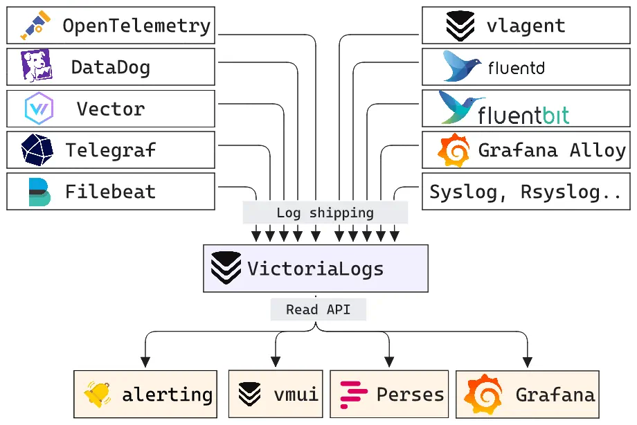

<!-- BEGIN SECTION feature_informations file=./.templates/feature_victorialogs.html -->

<div class="feature-detail">
  <h1 id="victorialogs">
    
    VictoriaLogs
  </h1>
  <h2>Basic Information</h2>
  <p>User friendly log database from VictoriaMetrics</p>
  <table>
    <tbody>
      <tr>
        <th>Category</th>
        <td>
<a href="/docs/all-features.md#system-health">System Health</a>
        </td>
      </tr>
      <tr>
        <th>Platform</th>
        <td>nixos</td>
      </tr>
      <tr>
        <th>Version</th>
        <td>1.50.0</td>
      </tr>
      <tr>
        <th>Site link</th>
        <td><a href="https://docs.victoriametrics.com/victorialogs/">https://docs.victoriametrics.com/victorialogs/</a></td>
      </tr>
      <tr>
        <th>Nix Homelab Module</th>
        <td><a href="../../modules/features/victorialogs">modules/features/victorialogs</a></td>
      </tr>
    </tbody>
  </table>
</div>

<!-- END SECTION feature_informations -->

## What is VictoriaLogs?

[VictoriaLogs](https://docs.victoriametrics.com/victorialogs/) is a log
database from VictoriaMetrics. In this homelab, it stores structured logs sent
by Vector and exposes a query UI plus APIs for log ingestion and search.

The feature runs a single VictoriaLogs service locally, exposes it through Caddy
when requested, provisions a Grafana logs datasource, and publishes its own
internal metrics to VictoriaMetrics.



## Why Use VictoriaLogs?

> Central log storage for Vector pipelines and Grafana exploration

**Key benefits:**

- **Centralized Logs**: Receives logs from Vector, including MikroTik CEF
  events
- **Structured Streams**: Uses VictoriaLogs stream fields for efficient log
  storage and filtering
- **Grafana Integration**: Provisions the VictoriaLogs datasource plugin and the
  VictoriaLogs dashboard
- **Health Checks**: Publishes `/ping` checks for Gatus and Homepage monitoring
- **Self Monitoring**: Exposes `/metrics`, scraped by VictoriaMetrics through
  the homelab integration registry

## Configuration

### Enable the feature

```nix
homelab.features.victorialogs = {
  enable = true;
  openFirewall = true;
  serviceDomain = "journaux.${config.homelab.domain}";
  registerScope = [ "private" ];
  listenInterfaces = [
    "vlan-lan"
  ];
};
```

When `openFirewall` is enabled, Caddy exposes the service at
`https://${config.homelab.features.victorialogs.serviceDomain}` and proxies it
to the local VictoriaLogs listener.

### Forward Vector logs

VictoriaLogs receives homelab logs through the Vector feature:

```nix
homelab.features.vector = {
  enable = true;
  cef.enable = true;
  cef.listenInterfaces = [
    "vlan-lan"
  ];
  cef.mikrotikFirewall.enable = true;
  cef.mikrotikLogin.enable = true;
  cef.mikrotikDhcp.enable = true;
  victorialogs.enable = true;
};
```

The Vector sink writes to the VictoriaLogs Elasticsearch bulk endpoint:

```text
http://127.0.0.1:10230/insert/elasticsearch/
```

The sink sets VictoriaLogs fields for message, timestamp, and stream grouping:

```text
_msg_field=message
_time_field=timestamp
_stream_fields=service,source_host,app_name
```

### MikroTik remote logging

Routers can send syslog/CEF events to the Vector collector. Example RouterOS
commands:

```routeros
/system logging action add name=victorialogs target=remote remote=<collector-ip> remote-port=5514 bsd-syslog=yes syslog-facility=local0
/system logging add topics=info action=victorialogs
/system logging add topics=warning action=victorialogs
/system logging add topics=error action=victorialogs
/system logging add topics=critical action=victorialogs
```

Adjust the port to match `homelab.features.vector.cef.port` on the collector.

## Grafana

When Grafana is enabled, this feature provisions:

- the `victoriametrics-logs-datasource` plugin
- a `VictoriaLogs` datasource pointing to the VictoriaLogs service URL
- the `VictoriaLogs - single-node` dashboard from
  `modules/nixos/features/victorialogs/grafana_dashboard.json`

The Grafana dashboard uses Prometheus-compatible metrics, so it depends on the
VictoriaMetrics scrape configured by this feature.

## Metrics

VictoriaLogs exposes Prometheus metrics on `/metrics`. The module publishes this
scrape automatically:

```nix
homelab.integrations.services.victorialogs.victoriametrics = {
  metrics_path = "/metrics";
  static_configs = [
    {
      targets = [ "127.0.0.1:10230" ];
      labels = {
        instance = config.networking.hostName;
        service = "victorialogs";
      };
    }
  ];
};
```

`vmagent` turns this into the `victorialogs` scrape job.

## Operations

### Service commands

```bash
@service-victorialogs-status
@service-victorialogs-journal
@service-victorialogs-config
```

### Vector agent commands

These aliases are available when Vector forwarding to VictoriaLogs is enabled:

```bash
@service-victorialogs-agent-status
@service-victorialogs-agent-journal
@service-victorialogs-agent-config
```

### Check the local endpoints

```bash
curl http://127.0.0.1:10230/ping
curl http://127.0.0.1:10230/metrics
```

## Troubleshooting

### Dashboard has no data

Check that VictoriaMetrics scrapes VictoriaLogs:

```bash
systemctl cat vmagent
```

Look for a `job_name` named `victorialogs` with target `127.0.0.1:10230`.

### Logs are not ingested

Check Vector and VictoriaLogs:

```bash
journalctl -u vector -b --no-pager -n 200
journalctl -u victorialogs -b --no-pager -n 200
```

If Vector starts but VictoriaLogs remains empty, verify that:

- `homelab.features.vector.victorialogs.enable = true`
- at least one Vector source is enabled
- the VictoriaLogs endpoint is reachable from the Vector process
- the RouterOS remote logging port matches the Vector CEF port

### Check Vector configuration

```bash
@service-vector-config
```

This validates the generated Vector YAML used by the systemd service.

## Learn More

- [VictoriaLogs Documentation](https://docs.victoriametrics.com/victorialogs/)
- [VictoriaLogs Data Ingestion](https://docs.victoriametrics.com/victorialogs/data-ingestion/)
- [VictoriaLogs Querying](https://docs.victoriametrics.com/victorialogs/querying/)
- [Vector Documentation](https://vector.dev/docs/)
