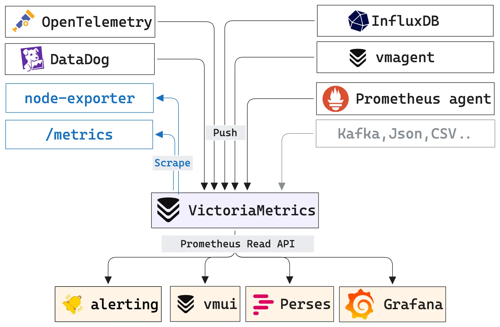

<!-- BEGIN SECTION feature_informations file=./.templates/feature_victoriametrics.html -->

<div class="feature-detail">
  <h1 id="victoriametrics">
    
    Victoriametrics
  </h1>
  <h2>Basic Information</h2>
  <p>Fast, cost-effective and scalable time series database, long-term remote storage for Prometheus</p>
  <table>
    <tbody>
      <tr>
        <th>Category</th>
        <td>
<a href="/docs/all-features.md#system-health">System Health</a>
        </td>
      </tr>
      <tr>
        <th>Platform</th>
        <td>nixos</td>
      </tr>
      <tr>
        <th>Version</th>
        <td>1.145.0</td>
      </tr>
      <tr>
        <th>Site link</th>
        <td><a href="https://victoriametrics.com/">https://victoriametrics.com/</a></td>
      </tr>
      <tr>
        <th>Nix Homelab Module</th>
        <td><a href="../../modules/features/victoriametrics">modules/features/victoriametrics</a></td>
      </tr>
    </tbody>
  </table>
</div>

<!-- END SECTION feature_informations -->

## What is VictoriaMetrics?

[VictoriaMetrics](https://victoriametrics.com/) is a time series database that
can ingest Prometheus remote-write data and serve Prometheus-compatible queries.
In this homelab, it is the central metrics backend used by Grafana dashboards
and by features that publish scrape configurations.

The feature enables a single-node VictoriaMetrics service and a `vmagent`
collector. `vmagent` scrapes local feature integrations, then writes metrics
back to VictoriaMetrics through the remote-write endpoint.

Alerting is handled by `vmalert` and Alertmanager. `vmalert` reads metrics from
VictoriaMetrics, evaluates alerting rules published by homelab features, then
sends firing alerts to Alertmanager. Grafana reads datasource-managed alert
state through VictoriaMetrics and Alertmanager.



## Components

| Component | Role |
| --- | --- |
| VictoriaMetrics | Stores metrics |
| `vmagent` | Collects and scrapes metrics |
| `vmalert` | Evaluates alerting rules |
| Alertmanager | Routes, groups, silences, and sends notifications |

## Internal Ports

The feature reserves a small port range from
`10000 + config.homelab.portRegistry.victoriametrics.appId`:

| Port | Component |
| --- | --- |
| `10030` | VictoriaMetrics |
| `10031` | `vmagent` |
| `10032` | `vmalert` |
| `10033` | Alertmanager |

## Why Use VictoriaMetrics?

> Central metrics storage with automatic local scrape integration

**Key benefits:**

- **Prometheus Compatible**: Supports Prometheus-style scrape configs and query
  workflows
- **Integrated Scraping**: Consumes `homelab.integrations.services.*.victoriametrics`
  from other features
- **Long Retention**: The module configures long-term retention for homelab
  metrics
- **Self Monitoring**: VictoriaMetrics scrapes its own internal metrics with
  `-selfScrapeInterval=5s`
- **Grafana Ready**: Provisions VictoriaMetrics and Prometheus datasources plus
  the VictoriaMetrics single-node dashboard
- **Datasource-managed Alerting**: Uses `vmalert` and Alertmanager for
  Prometheus-compatible alert rules

## Configuration

### Enable the feature

```nix
homelab.features.victoriametrics = {
  enable = true;
  openFirewall = true;
  serviceDomain = "sondes.${config.homelab.domain}";
  registerScope = [ "private" ];
  listenInterfaces = [
    "vlan-lan"
  ];
};
```

When `openFirewall` is enabled, the service is exposed through Caddy on
`https://${config.homelab.features.victoriametrics.serviceDomain}` and proxied
to the local VictoriaMetrics listener.

### Add custom scrape configs

Feature modules should usually publish scrapes through
`homelab.integrations.services.<service>.victoriametrics`. For one-off targets,
use `scrapeConfigs` directly:

```nix
homelab.features.victoriametrics.scrapeConfigs = [
  {
    job_name = "custom-exporter";
    metrics_path = "/metrics";
    static_configs = [
      {
        targets = [ "127.0.0.1:9273" ];
        labels = {
          instance = config.networking.hostName;
          service = "custom-exporter";
        };
      }
    ];
  }
];
```

### Feature integrations

Other features can publish metrics without editing the VictoriaMetrics module:

```nix
homelab.integrations.services.example.victoriametrics = {
  metrics_path = "/metrics";
  static_configs = [
    {
      targets = [ "127.0.0.1:9000" ];
      labels = {
        instance = config.networking.hostName;
        service = "example";
      };
    }
  ];
};
```

The VictoriaMetrics module turns each integration into a `vmagent` scrape job.
The job name is the integration key.

### Add alerting rules

Feature modules can publish `vmalert` rule groups through
`homelab.integrations.services.<service>.vmalert`:

```nix
homelab.integrations.services.example.vmalert = {
  ruleGroups = [
    {
      name = "example";
      interval = "1m";
      rules = [
        {
          alert = "ExampleTargetMissing";
          expr = ''absent_over_time(up{service="example"}[5m])'';
          for = "2m";
          labels = {
            service = "example";
            severity = "critical";
          };
          annotations.description = "The example service has no metrics.";
        }
      ];
    }
  ];
};
```

## Grafana

When Grafana is enabled, this feature provisions:

- the `victoriametrics-metrics-datasource` plugin
- a default `VictoriaMetrics` datasource
- a Prometheus-compatible `Prometheus` datasource
- an `Alertmanager` datasource for alert silences and notifications state
- the `VictoriaMetrics - single-node` dashboard from
  `modules/nixos/features/victoriametrics/grafana_dashboard.json`

The dashboard reads metrics from the default VictoriaMetrics datasource. Alert
list panels can use the VictoriaMetrics datasource once `vmalert` rules are
enabled and proxied through VictoriaMetrics.

## Operations

### Service commands

```bash
@service-victoriametrics-status
@service-victoriametrics-journal
@service-victoriametrics-config
```

### Agent commands

```bash
@service-victoriametrics-agent-status
@service-victoriametrics-agent-journal
@service-victoriametrics-agent-config
```

### Alerting commands

```bash
@service-victoriametrics-alert-status
@service-victoriametrics-alert-journal
@service-victoriametrics-alert-config
@service-victoriametrics-alertmanager-status
@service-victoriametrics-alertmanager-journal
```

### Check the local endpoints

```bash
curl http://127.0.0.1:10030/metrics
curl http://127.0.0.1:10030/api/v1/query \
  --data-urlencode 'query=vm_app_version'
curl http://127.0.0.1:10030/api/v1/rules
curl http://127.0.0.1:10030/api/v1/alerts
curl http://127.0.0.1:10032/metrics
curl http://127.0.0.1:10033/-/ready
```

### List metric names

```bash
curl "http://127.0.0.1:10030/api/v1/label/__name__/values" | jq .
```

### Get a metric series

```bash
curl -s 'http://127.0.0.1:10030/api/v1/series?match[]=security_events_counter'
```

### Delete a metric series

```bash
curl -X POST 'http://127.0.0.1:10030/api/v1/admin/tsdb/delete_series' \
  -d 'match[]={__name__="vector_security_malicious_ips"}'
```

## Troubleshooting

### Check that scrapes are generated

```bash
systemctl cat vmagent
```

Look for the generated Prometheus config and confirm that the expected
`job_name` entries exist.

### Check remote-write ingestion

```bash
journalctl -u vmagent -b --no-pager -n 200
journalctl -u victoriametrics -b --no-pager -n 200
```

If dashboards are empty, check that:

- the exporting feature is enabled
- the target listens on `127.0.0.1:<port>`
- the target exposes `/metrics`
- `vmagent` contains the expected scrape job
- Grafana uses the provisioned VictoriaMetrics datasource

### Check alerting state

```bash
journalctl -u vmalert-homelab -b --no-pager -n 200
journalctl -u alertmanager -b --no-pager -n 200
curl http://127.0.0.1:10030/api/v1/rules | jq .
curl http://127.0.0.1:10030/api/v1/alerts | jq .
```

If alerts are missing from Grafana, check that:

- at least one feature publishes `vmalert.ruleGroups`
- `vmalert-homelab` is running
- VictoriaMetrics has `-vmalert.proxyURL` configured
- the `Alertmanager` datasource is provisioned in Grafana

## Learn More

- [VictoriaMetrics Documentation](https://docs.victoriametrics.com/victoriametrics/)
- [Single-node VictoriaMetrics](https://docs.victoriametrics.com/victoriametrics/single-server-victoriametrics/)
- [vmagent](https://docs.victoriametrics.com/victoriametrics/vmagent/)
- [vmalert](https://docs.victoriametrics.com/victoriametrics/vmalert/)
- [Prometheus Scrape Configuration](https://prometheus.io/docs/prometheus/latest/configuration/configuration/#scrape_config)
