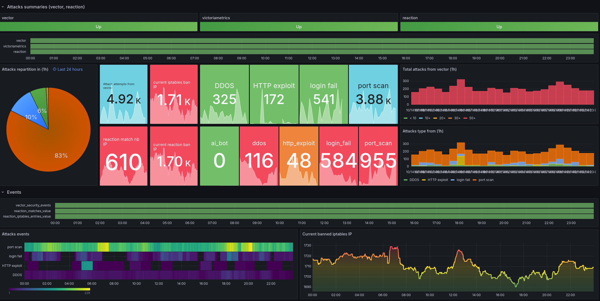

# Grafana - Analytics & Monitoring Platform

<p align="center">
  
</p>

## What is Grafana?

[Grafana](https://grafana.com/) is an open-source analytics and monitoring
platform that allows you to query, visualize, alert on, and explore your
metrics, logs, and traces from any data source.

Grafana transforms time-series data into beautiful graphs and visualizations,
making it the de facto standard for monitoring dashboards in modern
infrastructure. It's the visualization layer for your observability stack.

## Why Use Grafana?

> Transform your metrics into beautiful, actionable insights

**Key benefits:**

- **Universal Data Source Support**: Connect to Prometheus, InfluxDB,
  VictoriaMetrics, PostgreSQL, and 100+ other data sources
- **Beautiful Dashboards**: Create stunning, interactive visualizations with
  minimal effort
- **Powerful Alerting**: Set up sophisticated alert rules and notifications
- **Extensive Plugin Ecosystem**: Thousands of plugins for panels, data sources,
  and apps
- **Role-Based Access Control**: Granular permissions for teams and users
- **Query Builder**: Intuitive interface for building complex queries without
  learning query languages
- **Open Source**: Free, community-driven, with enterprise options available

## Key Features

### 1. Multi-Source Dashboards

Combine data from multiple sources (Prometheus, InfluxDB, VictoriaMetrics, etc.)
in a single dashboard for comprehensive monitoring.

### 2. Advanced Visualization

Wide variety of visualization types:

- Time series graphs
- Heatmaps
- Histograms
- Stat panels
- Tables
- Gauge and bar gauge
- Pie charts and more

### 3. Alerting System

Sophisticated alerting engine with:

- Multi-dimensional alerting
- Alert rules based on queries
- Notification channels (email, Slack, Discord, PagerDuty, etc.)
- Alert silencing and grouping

### 4. Plugin Ecosystem

Extend functionality with:

- Data source plugins (add new databases)
- Panel plugins (custom visualizations)
- App plugins (complete applications)

### 5. Template Variables

Create dynamic, reusable dashboards with variables for:

- Hosts
- Services
- Time ranges
- Custom values

### 6. Data Exploration

Interactive query builder and data explorer for ad-hoc analysis without creating
permanent dashboards.

### 7. Role-Based Access Control (RBAC)

Fine-grained permissions:

- Organization-level access
- Dashboard-level permissions
- Folder-based organization

## Service Information

|                key | value                                 |
| -----------------: | ------------------------------------- |
|  installation type | **nixos service**                     |
| service management | `systemctl <COMMAND> grafana`         |
|           web port | 10009 (internal)                      |
|               fqdn | `lampiotes.ma-cabane.eu`              |
| application folder | `/var/lib/grafana`                    |
|      backup folder | `/var/backup/grafana` (PostgreSQL DB) |
|             backup | see [borgbackup](./borgbackup.md)     |

### Configuration

The Grafana instance is configured in
[machines/houston/modules/grafana.nix](../machines/houston/modules/grafana.nix).

Key configuration parameters:

- **HTTP Port**: `10009` (behind Nginx reverse proxy)
- **Database**: PostgreSQL (database name: `grafana`)
- **Admin User**: `admin`
- **Admin Password**: Auto-generated (see secrets)
- **Anonymous Access**: Disabled
- **User Signup**: Disabled
- **Analytics**: Disabled (reporting and update checks)

## Initial Setup

After deploying Grafana with Clan:

1. Access the URL: `https://lampiotes.ma-cabane.eu`

2. Log in using:
   - Username: `admin`
   - Password: `clan vars get houston grafana/admin_password`

3. Configure data sources (Prometheus, InfluxDB, etc.)

4. Import or create dashboards

## Data Sources

### Prometheus Integration

Grafana is configured to work with Prometheus, which is enabled on the houston
server:

```nix
services.prometheus.enable = true;
```

To add Prometheus as a data source in Grafana:

1. Go to `Configuration` → `Data Sources` → `Add data source`
2. Select `Prometheus`
3. Set URL to `http://localhost:9090`
4. Click `Save & Test`

## Operations

### Reset Admin Password

If you need to reset the admin password manually:

```bash
# On houston server
runuser grafana -s /run/current-system/sw/bin/bash
grafana cli -homepath /var/lib/grafana --config=/nix/store/x5hyfmwda1sssl4s6g9xc2z0wp0zzj1r-config.ini admin reset-admin-password "<NEW_PASSWORD>"
```

Or regenerate credentials using Clan:

```bash
# Regenerate all Grafana credentials
clan vars generate houston grafana

# Get the new password
clan vars get houston grafana/admin_password

# Restart Grafana
systemctl restart grafana
```

### Get Admin Password

To retrieve the current admin password:

```bash
# On houston server
clan vars get houston grafana/admin_password
```

## Learn More

- [Official Documentation](https://grafana.com/docs/grafana/latest/)
- [Dashboard Gallery](https://grafana.com/grafana/dashboards/)
- [Plugin Directory](https://grafana.com/grafana/plugins/)
- [Grafana Tutorials](https://grafana.com/tutorials/)
- [Best Practices](https://grafana.com/docs/grafana/latest/best-practices/)
- [NixOS Module](../machines/houston/modules/grafana.nix)
