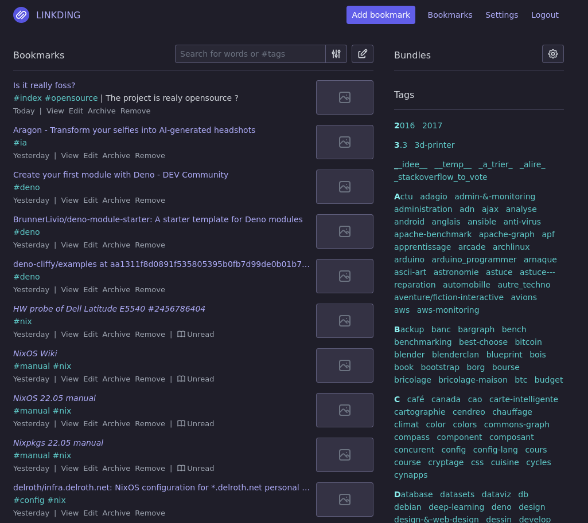

# Linkding



## 🔐 Secret

Linkding requires a secret key to securely the web interface

Generate a strong secret using the following command:

```bash
nix shell nixpkgs#pwgen --command pwgen 12 -s
```

Then add it to your `configuration/hosts/<HOSTNAME>/secrets.yml`:

```yaml
services:
  linkding:
    superuser-password: <paste the output of the command above>
```

> 💡 Replace `<HOSTNAME>` with your actual host directory name.

## Import bookmarks from browsers (Firefox)

First, install the
[bookmarks organizer](https://addons.mozilla.org/fr/firefox/addon/bookmarks-organizer/)
plugin for Firefox and clean up broken links.

Then import the bookmarks using the [buku](https://github.com/jarun/buku) tool.
It automatically tags bookmarks based on folder names.

```bash
nix shell nixpkgs#buku
buku --ai
buku -e bookmark-with-tags.html
```

## Borg backup restoration

### The archive

```bash
sudo systemctl stop docker-linkding
sudo my-borg linkding list ${BORG_REPO_BASE}/./linkding
( cd / && sudo my-borg linkding extract ${BORG_REPO_BASE}/./linkding::badxps-linkding-2025-06-11T00:00:04)
sudo systemctl start docker-linkding
```
