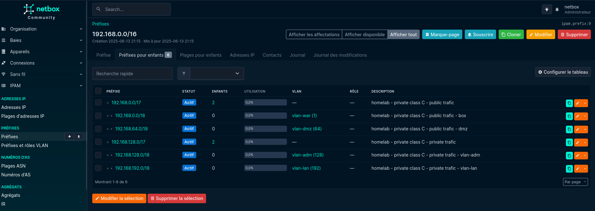

<!--toc:start-->

- [🔐 Secret](#🔐-secret)
- [👤 Superuser account](#👤-superuser-account)
- [Plugins](#plugins)
  - [Update](#update)
    - [netbox-topology-views](#netbox-topology-views)
- [Borg backup restoration](#borg-backup-restoration)
  - [The archive](#the-archive)
  - [Netbox database](#netbox-database)

<!--toc:end-->



## 🔐 Secret

NetBox requires a secret key to securely hash passwords and HTTP cookies.

Generate a strong secret using the following command:

```bash
nix shell nixpkgs#openssl --command openssl rand -hex 50
```

Then add it to your `configuration/hosts/<HOSTNAME>/secrets.yml`:

```yaml
services:
  netbox:
    secret: <paste the output of the command above>
```

> 💡 Replace `<HOSTNAME>` with your actual host directory name.

---

## 👤 Superuser account

By default, NetBox does not create a user account during installation. You need
to manually create a **superuser** account.

Run the following command:

```bash
netbox-manage createsuperuser
```

You will be prompted to enter the credentials:

```text
Username (leave blank to use 'netbox'): admin
Email address: netbox@local.local
Password:
Password (again):
```

## Plugins

### Update

#### netbox-topology-views

```bash
sudo -u netbox bash
NETBOX=$(systemctl show netbox | grep -oE -- '--pythonpath .*/opt/netbox/netbox' | head -n1 | awk '{ print $2 }')
PYTHON=$(head -n1 $NETBOX/manage.py | grep -oE '/.*')

systemctl show netbox | grep -E '^Environment='

# Before launching python3 command, manual copy all environment variable
# ex: LOCALE_ARCHIVE=/nix/store/xxx-glibc-locales-2.40-66/lib/locale/locale-archive PATH=/nix/store/xxx-coreutils-9.7/bin $PYTHON xxx
cd $NETBOX
ALLVARS=see_previous_line $PYTHON manage.py migrate netbox_topology_views
ALLVARS=see_previous_line $PYTHON manage.py collectstatic --no-input
```

## Borg backup restoration

### The archive

```bash
sudo my-borg netbox list ${BORG_REPO_BASE}/./netbox
( cd / && sudo my-borg netbox extract ${BORG_REPO_BASE}/./netbox::badxps-netbox-2025-06-11T00:00:04)
```

### Netbox database

```bash
sudo -u postgres dropdb netbox sudo -u postgres createdb netbox
nix shell nixpkgs#postgresql --command sudo -u postgres pg_restore -Fd -d netbox /data/borgbackup/postgresql/netbox
```
