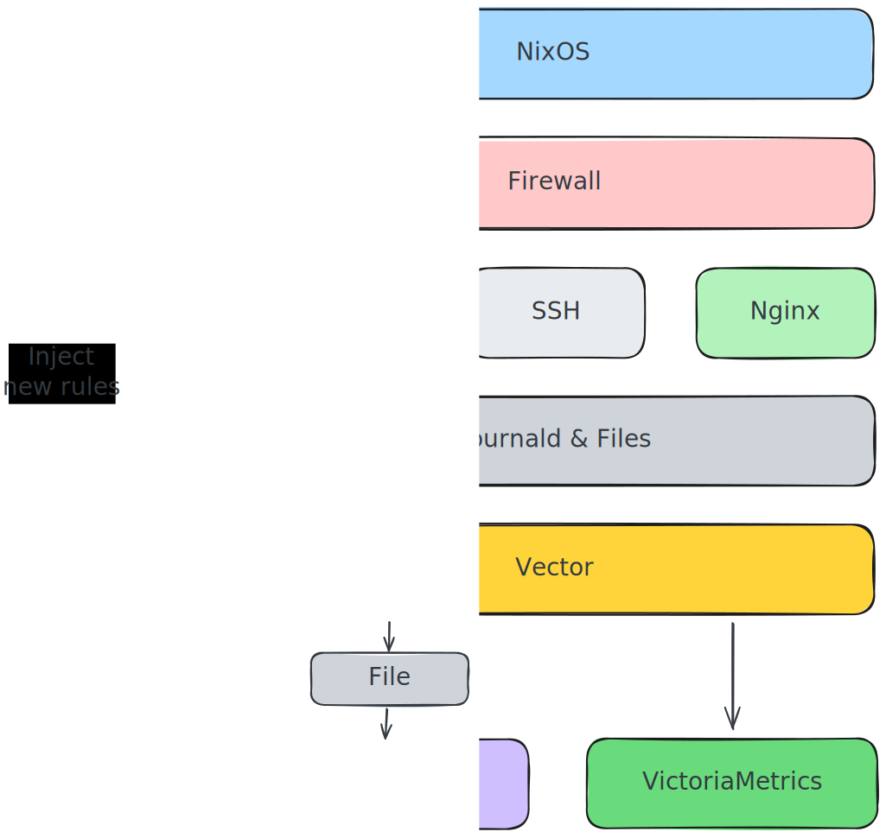

# Houston Server

Houston is my main public server, running on a Hetzner VPS. It serves as the
central hub for authentication, monitoring, and various web applications.

## Infrastructure

### Instance Specifications

- **Provider**: [Hetzner Cloud](../hetzner.md)
- **Instance Type**: [CX32](https://www.hetzner.com/cloud/)
- **CPU**: 4 Intel vCPU cores
- **RAM**: 8 GB
- **Storage**: 80 GB SSD
- **Bandwidth**: 20TB included traffic
- **Location**: Nuremberg, Germany
- **IPv4**: 91.99.130.127

## Services Overview

Houston provides three main categories of services:

### Authentication Infrastructure

- 📑 **[Authelia](../../docs/authelia.md)**: Single Sign-On (SSO) authentication
  portal
- 📑 **[LLDAP](../../docs/lldap.md)**: Lightweight LDAP directory service for
  user management

### Monitoring & Observability

- 📑 **[Grafana](../../docs/grafana.md)**: Visualization and analytics platform
  for metrics
- 📑 **[Reaction](../../docs/reaction.md)**: Alert reaction system
- ⚙️ **[Telegraf](./modules/telegraf)**: Metrics collection agent
- 📑 **[Vector](../../docs/vector.md)**: Observability data pipeline
- 📑 **[VictoriaMetrics](../../docs/victoriametrics.md)**: Time series database

### Applications

- 📑 **[DokuWiki](../../docs/dokuwiki.md)**: Wiki software for documentation
- ⚙️ **[GoAccess](./modules/goaccess.nix)**: Real-time web log analyzer
- ⚙️ **[Homepage Dashboard](./modules/homepage-dashboard.nix)**: Application
- 📑 **[Linkding](../../docs/linkding.md)**: Bookmark manager
- ⚙️ **[Miniflux](./modules/miniflux.nix)**: Minimalist RSS feed reader
- ⚙️ **[Pawtunes](./modules/pawtunes.nix)**: Music streaming service
- ⚙️ **[Shaarli](./modules/shaarli.nix)**: Personal link sharing platform
  dashboard
- ⚙️ **[Wastebin](./modules/wastebin.nix)**: Minimalist pastebin

## Service Details

### Authentication & SSO

All services are protected by Authelia, which provides:

- Two-factor authentication (2FA)
- Single Sign-On across all applications
- Integration with LLDAP for centralized user management

### Deployment Strategy

Houston uses a hybrid deployment approach:

- **NixOS Services**: Most services run as native NixOS services for better
  integration
- **Podman Containers**: Some services (DokuWiki, Linkding, LLDAP, Shaarli) run
  in containers because:
  - NixOS packages are non-existent or partially functional
  - Isolation from system updates
  - Easier version management

### Firewall & Security Stack

Houston implements an automated defense system against attacks (port scans,
brute force, exploits, etc.).


**How it works:**

1. **[Vector](./modules/vector/default.nix)**: Collects and analyzes logs from
   SSH, nginx, and iptables. Detects suspicious patterns (failed logins, port
   scans, HTTP exploits, AI bots) and classifies them by risk level.

2. **[Reaction](./modules/reaction.nix)**: Automatically bans malicious IPs in
   iptables (3 attempts in 4h → 7 days ban). Supports IPv4/IPv6 with temporary
   bans and whitelisting.

3. **[VictoriaMetrics](../../docs/victoriametrics.md)**: Stores attack metrics
   for visualization in Grafana (attack trends, geographic distribution, ban
   effectiveness).



## Initial deployment

1. Add new machine

```bash
just machine-add houston
```

2. Get Device ID and edit `machines/houston/configuration.nix` and change host
   IP and installation disk destination `disko.devices.disk.main.device` (ex:
   `/dev/disk/by-id/xxx` or `/dev/sda`)

```bash
just machine-get-disk-id 192.168.254.137
```

### Terraform

```bash
nix run .#terraform
```

## Update deployment

Update host installation

```bash
clan machines update houston
```

### Redeploy

```bash
nix run .#terraform
nix run .#terraform.terraform -- apply -replace "hcloud_server.houston"
```

### Destroy

```bash
nix run .#terraform
nix run .#terraform.terraform -- destroy -target "hcloud_server.houston"
```

## Update deployment

```bash
clan machines update houston
```
